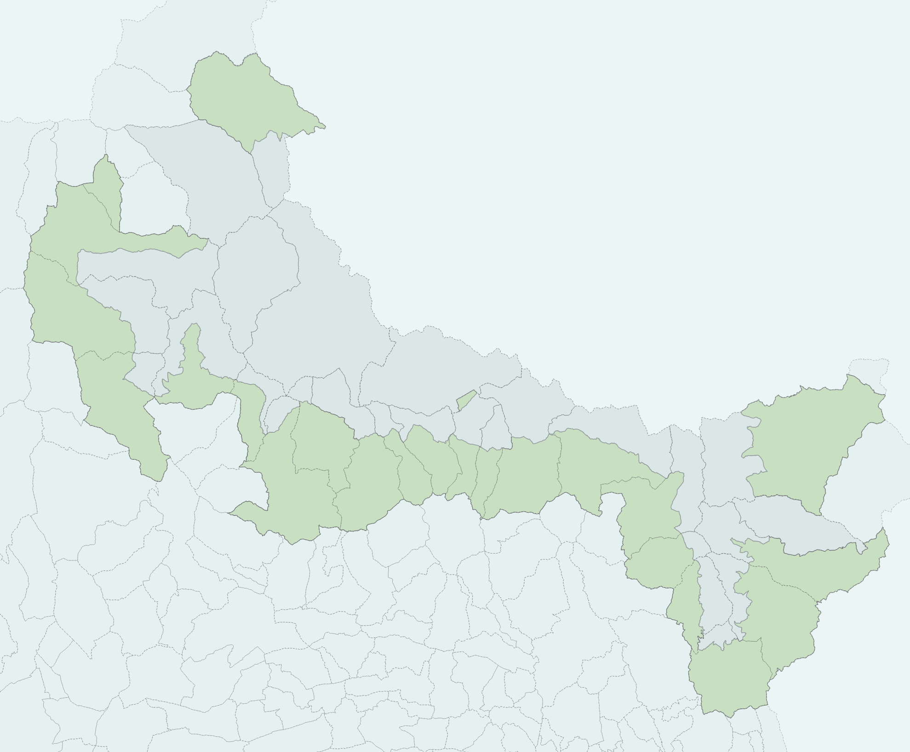

# limites

## Description

Le schema `limites` donne accès aux données géographiques réglementaires du Parc national du Mercantour 
et des entités administratives remarquables aux alentours:
- les différentes zones du PNM
- la liste des communes de l'aire optimale d'adhésion
- la répartition géographique des services territoriaux 


___NB: Les limites doivent être revues. Elles peuvent être utilisées à fin illustratives, mais leurs localisations précises sont en cours de révision.
Si des statistiques précises concernant les superficies de communes en coeur de parc, se référer au document spécifiquement produites pour le calcul de 
"X:\6.7 SYSTEME INFORMATION\6_OUTILS_MEMO\STATS-CHIFFRES CLES\Données par communes.xlsx"___

<!-- ## Utilisation du projet qgis 

le projet qgis "mailles" ne contien -->


## Les limites du parc

Les parcs nationaux sont divisés en plusieurs zones, encadrés par des réglementation plus ou moins strictes. 
Vous trouverez ci-dessous les définitions des principales zones ainsi que leur illustration:


### Aire d’adhésion

Espace de cohérence et de solidarité écologique avec le cœur du parc constitué des territoires des communes de l’aire optimale d’adhésion ayant adhéré à la charte. Aussi complétée par l’aire maritime adjacente pour certains parcs nationaux.

### Aire optimale d’adhésion

Espace comprenant l’ensemble des communes ayant vocation à adhérer à la charte du parc national au sein duquel les activités humaines pouvant s’y exercer sont réglementées en cohérence avec les objectifs de gestion du parc décrits dans la charte.

### Cœur de parc national

Territoire d’un parc national, terrestre ou marin, soumis à une réglementation particulière stricte encadrant certaines activités, afin de s’assurer de leur compatibilité avec la préservation du patrimoine naturel, culturel et paysager.

### Périmètre d’étude de la charte
Territoire d’ensemble d’un parc national comprenant le cœur et l’aire optimale d’adhésion.

### Territoire de parc national
Territoire composé du cœur et de l’aire d’adhésion d’un parc national.

Définitions trouvables sur [ce site](https://www.statistiques.developpement-durable.gouv.fr/edition-numerique/parcs-nationaux-2021/57-glossaire)

Dans le cas du Parc National du Mercantour voilà une illustration des différents territoires (les zones colorées correspondent à chaque délimitation)

|Délimitation                  |Surface(km²) |Carte|
|:---------------:             |:--:    |:--:|
|Aire d'Adhésion               |1211,7  ||
|Zone Coeur                    |679,1   ||
|Aire Optimale d'Adhésion      |1485    ||
|Périmètre d’étude de la charte|2164,1  ||
|Territoire de parc national   |1890,8  ||


## Calcul des aires dans le parc


### Données par communes

| **code INSEE** | **Nom commune**         | **Adhésion Charte (1=oui)**   | **Zone coeur (km²)** | **Aire Optimale d’Adhésion (km²)** |**Aire d’Adhésion (km²)** | **Surface Totale de la commune** | **% de ZC** | **% en AOA** |
| -------------- | ----------------------- | ----------------------------- | -------------------- | ----------------------------------- | ---------------------- |---------------------------------- | ----------- | ------------ | 
| 04006          | Allos                   | 1                             | 41,8                 | 75,4                                | 75,4                 |117,2                             | 35,7         | 64,3         | 
| 04019          | Barcelonnette           | 1                             | 0,0                  | 16,6                                | 16,6                 |16,6                              | 0,0          | 100,0        | 
| 06013          | Belvédère               | 1                             | 31,0                 | 44,3                                | 44,3                 |75,3                              | 41,1       | 58,9         | 
| 06016          | Beuil                   | 1                             | 24,2                 | 50,3                                | 50,3                 |74,5                              | 32,5       | 67,5         | 
| 06020          | Bollene Vésubie         | 1                             | 5,6                  | 29,8                                | 29,8                 |35,3                              | 15,7       | 84,3         | 
| 06023          | Breil sur Roya          | 1                             | 17,6                 | 64,3                                | 64,3                 |81,9                              | 21,4       | 78,6         | 
| 06040          | Chateauneuf d'Entraunes | 1                             | 10,9                 | 18,6                                | 18,6                 |29,5                              | 37,0       | 63,0         | 
| 04061          | Colmars                 | 1                             | 11,9                 | 69,8                                | 69,8                 |81,7                              | 14,5       | 85,5         | 
| 06056          | Entraunes               | 1                             | 48,5                 | 31,5                                | 31,5                 |80,0                              | 60,6       | 39,4         | 
| 06062          | Fontan                  | 0                             | 11,3                 | 38,2                                | 0                    |49,5                              | 22,9       | 77,1         | 
| 06071          | Guillaumes              | 1                             | 8,2                  | 78,2                                | 78,2                 |86,5                              | 9,5        | 90,5         | 
| 06073          | Isola                   | 1                             | 10,6                 | 89,0                                | 89,0                 |99,6                              | 10,6       | 89,4         | 
| 04096          | Jausiers                | 0                             | 13,4                 | 94,9                                | 0                    |108,3                             | 12,3       | 87,7         | 
| 06086          | Moulinet                | 1                             | 19,6                 | 21,4                                | 21,4                 |41,0                              | 47,7       | 52,3         | 
| 06094          | Péone                   | 1                             | 5,5                  | 43,0                                | 43,0                 |48,4                              | 11,3       | 88,7         | 
| 06102          | Rimplas                 | 1                             | 10,6                 | 14,2                                | 14,2                 |24,8                              | 42,8       | 57,2         | 
| 06110          | Roubion                 | 1                             | 7,6                  | 19,4                                | 19,4                 |27,0                              | 28,2       | 71,8         | 
| 06111          | Roure                   | 1                             | 16,1                 | 23,6                                | 26,6                 |39,7                              | 40,5       | 59,5         | 
| 06119          | St Dalmas selvage       | 0                             | 48,8                 | 32,1                                | 0                    |81,0                              | 60,3       | 39,7         | 
| 06120          | St Etienne Tinée        | 0                             | 64,7                 | 108,0                               | 0                    |172,7                             | 37,4       | 62,6         | 
| 06127          | St Martin Vésubie       | 1                             | 45,5                 | 52,1                                | 52,1                 |97,6                              | 46,6       | 53,4         | 
| 06129          | St Sauveur Tinée        | 1                             | 16,0                 | 16,2                                | 16,2                 |32,2                              | 49,7       | 50,3         | 
| 06132          | Saorge                  | 1                             | 25,5                 | 59,1                                | 59,1                 |84,6                              | 30,1       | 69,9         | 
| 06136          | Sospel                  | 1                             | 7,1                  | 55,2                                | 55,2                 |62,3                              | 11,4       | 88,6         | 
| 06163          | Tende                   | 1                             | 50,3                 | 127,0                               | 127,0                |177,2                             | 28,4       | 71,6         | 
| 04226          | Uvernet Fours           | 1                             | 62,2                 | 73,5                                | 73,5                 |135,7                             | 45,8       | 54,2         | 
| 04120          | Val d’Oronaye           | 1                             | 23,4                 | 87,5                                | 87,5                 |110,9                             | 21,1       | 78,9         | 
| 06153          | Valdeblore              | 1                             | 41,4                 | 51,6                                | 51,6                  |93,0                             | 44,5       | 55,5         | 
|                | TOTAL                   |        -                       | 679,1                | 1485                                |1890,8 (=Territoire du parc)|2164,1 ( = Périmètre d'étude de la charte) |      -    |      -        |  


__NB: La surface en Aire d'Adhésion est égale à la surface en Aire Optimale d'Adhésion quand la commune adhère à la charte, sinon elle est égale à 0. La surface totale de l'Aire d'adhésion du parc est de 1211,7.__


### Méthode de calcul

Les données utilisées pour le calcul des aires par commune et pour l'ensemble du parc sont: 

- [Admin Express](https://geoservices.ign.fr/adminexpress]) (dans l'édition de mars 2024)
- les limites du parc [telles qu'elles ont été déposées sur le site de l'inpn](https://inpn.mnhn.fr/telechargement/cartes-et-information-geographique/ep/pn)

Les calculs d'aires ont été réalisées sur PostgreSQL, en utilisant la fonction "ST_AREA" appliquée à une géographie.


## Tables remarquables

Les tables suivantes peuvent être chargées directement dans QGIS.  Un style par défaut leur est <!-- (en principe) -->associé. 
 
 - _.area_ : Contient l'essentiel des géométrie d'intérêt. __Leur filtrage est nécessaire car ces géométries peuvent être superposées__.
 - _.area_type_ : Table de correspondance entre les identifiants d'area (_area.id_type_), un type et une description explicite.
 - _.limites_ : Contient les limites des zones d'intérêt du parc (coeur, aire d'adhésion....)
 - _.communes_ : Communes du parc
 - _.maille500m_ : Maillage à 500m de côté couvrant l'emprise du parc et des environs
 - _.maille1k_ :  Maillage à 1km de côté couvrant l'emprise du parc et des environs
 - _.maille10k_ :  Maillage à 10km de côté couvrant l'emprise du parc et des environs


## Description détaillée des tables
_Les tableaux suivants décrivent les principales tables du schéma, et certaines de leur variables. Sauf précision, il s'agit de tables._

### _.area_

Objets géographiques remarquables du PNM (zones réglementaires, communes, vallées ...)


| Nom de la colonne      | Type | Description     |
| :---        |    :----:   |:---: |
| id      | (PK) int       |   ... |
| id_type   | int        | numéro de correspondance avec la table _area.type_     |
| name   | string        | nom de l'objet     | <!-- remplacer "name" par "nom" -->
| description   | string        | ...     |
| geom   | geometry (multipolygon)        | ... |


<!-- Permet de traiter de façon uniforme les objets géographiques remarquables de types différents (par exemple le calcul de l'intersection de ces objets avec les mailles 1km) -->


### _.area_type_

Table de correspondance pour les objets géographiques remarquables.

| Nom de la colonne      | Type | Description     |
| :---        |    :----:   |          :---: |
| id      | (PK) int       |   ... |
| type   | int        | numéro d'identifiant de type d'objet géographique - fait la correspondance avec id_type de _limites.area_     |
| description      | string       |  ...   |

### _.communes_
Contient 28 entités.

| Nom de la colonne      | Type | Description     |
| :---        |    :----:   |          :---: |
| id      | (PK) int       |   ... |
| nom   | string        | nom de la commune  |
| code_insee      | int       | ...|
| canton/depart/ arrondisst/region     | str       |  nom de l'entité géographique  |
| popul | int       | population au dernier recensement <!-- lequel? --> |
| addhesion      | string       | deux valeurs: "oui", "non", concernant l'adhésion à la charte du PNM   |


### _.grid_ (Vue)
<!-- est-ce que cette grille couvre l'ensemble?  -->
Vue de synthèse donnant pour chaque maille de limites.maille1k la surface appartenant à chaque zone, et le nom de la vallée principale.


### limites.grid1k_area

_Ne contient que les polygones qui sont dans le parc_

Intersections des mailles 1000 et des polygones remarquables du PNM (table _area_),
c'est-à-dire qu'il contient des mailles fragmentées selon les zones qui les recouvrent.

| Nom de la colonne | Type | Description     |
| :---        |    :----:   |          :---: |
| id_grid      | (PK) int       |   ... |
|id_area	| (PK) int|  ...|
| surface   | string        | nom de la commune  |
| geom      | geometry       | ...|


### limites.limites
Contient 6 entités: coeur, aire d'adhésion.....

| Nom de la colonne  | Type | Description     |
| :---        |    :----:   | :---: |
| id      | (PK) int       |   ... |
| nom   | string        | nom de la zone (coeur, aire d'adhésion...)     |
| description   | string        | Détail sur le nom     |
| geom   | geometry        | nom de la zone (coeur, aire d'adhésion...)     |
| geom_simple   | geometry        | geométrie simplifiée     |

<!-- pas clair ce que la colonne "layer" veut dire -->


### limites.maille1k
Maillage de 1km de côté pavage normalisé  <!-- (EPSG:2154) les autres couches ne sont pas dans la même projection? -->

| Nom de la colonne      | Type | Description     |
| :---        |    :----:   |          :---: |
| id      | (PK) int       |   ... |
| id_sig   | string        |    ...  |
| code_10km   | string        | numéro identifiant la maille dans un carré de 10 km <!-- ? -->      |
| aire_*   | boolean        | indication (True/False) si la maille est dans une zone d'intérêt     |


### limites.maille500m
Maillage de 500m de côté


| Nom de la colonne      | Type | Description     |
| :---        |    :----:   |          :---: |
| id      | (PK) int       |   ... |
| position   | string        |   position de la maille 500m dans la maille 1km qui la contient (NE, NO, SE, SW)  |
| id_parent | int| id de la maille 1km parente |


## Projets QGIS

Pas de projet connu.

## Dépendances

Pas de dépendance connue.


_____
_Documentation pour utilisateurs avancés et maintenance_

<!-- toute la suite devrait être dans un autre document dédié au sql -->

# Utilisation du schema `limites` dans les projets SQL et QGIS

## Log Interne

Les objets géographiques remarquables du PNM (limites du parc, limites des communes du parc, services territoriaux, mailles 1km du territoire, etc) sont souvent utilisées dans les projets SQL et QGIS, ce qui nécessite l'optimisation des opérations de calcul les plus fréquentes (intersection, ...) par leur mise en cache.

Les traitements géométriques (intersections, inclusions) sont plus rapides lorsqu'il s'appliquent à des objets d'emprise réduite. On a donc découpé tous les objets géométriques remarquables suivant les mailles 1km et mis en cache la géométrie et la surface de l'intersection avec pour effet :

- l'identification immédiate des mailles 1km liées à chaque géométrie remarquable
- l'accélération des calculs de surface commune entre un objet géographique remarquable et une géométrie arbitraire.


### fonction limites.get_id_type

Retourne l'identifiant correspondant à un type. Par exemple:
```sql
select limites.get_id_type('st');
```
retourne l'identifiant de type des services territoriaux.

### fonction limites.get_id_area

Retourne l'identifiant d'un objet géographique remarquable à partir de son type et de son nom. Par exemple
```sql
select limites.get_id_area('limites', 'coeur');
```
retourne l'identifiant de l'objet `coeur` de type `limites`.


### Exemples d'utilisation de la table grid1k_area

La table peut être utilisée directement ou en conjonction avec les mailles 1000 pour déterminer les relations géométriques entre une géométrie arbitraire et l'un des multipolygones.


Exemple: Pour retrouver la surface coeur de chaque commune

```sql
select
	round(sum(case
                when gcoeur.surface = 1000000 then gcom.surface
                when gcom.surface = 1000000 then gcoeur.surface
                else st_area(st_intersection(gcoeur.geom, gcom.geom))
            end)) "surface coeur",
	name commune
from
	limites.grid1k_area gcom
join limites.area on
	gcom.id_area = area.id
join (
	select
		*
	from
		limites.grid1k_area
	where
		id_area = limites.get_id_area('limites',
		'coeur'))gcoeur
		using (id_grid)
where
	area.id_type = limites.get_id_type('communes')
group by
	area.name
order by
	area.name;
```

Pour retrouver la Surface du ST Haut Var Cians en coeur de parc

```sql
-- méthode grid
select round(sum(
        case
            when a.surface = 1000000 then b.surface
            when b.surface = 1000000 then a.surface
            else st_area(st_intersection(a.geom, b.geom))
        end
    ))
from limites.grid1k_area a
    join limites.grid1k_area b on a.id_grid = b.id_grid
where a.id_area = limites.get_id_area('limites','coeur')
    and b.id_area = limites.get_id_area('st', 'Haut Var Cians');

-- méthode classique
select round(st_area(st_intersection(a.geom, b.geom)))
from limites.area a,
    limites.area b
where a.id = limites.get_id_area('limites','coeur')
    and b.id = limites.get_id_area('st', 'Haut Var Cians');
```

Intersection du ST Haut Var Cians et du coeur de parc

```sql
-- méthode grid
select st_union(
    case
        when a.surface = 1000000 then b.geom
        when b.surface = 1000000 then a.geom
        else st_intersection(a.geom, b.geom)
    end
)
from limites.grid1k_area a
    join limites.grid1k_area b on a.id_grid = b.id_grid
where a.id_area = limites.get_id_area('limites','coeur')
    and b.id_area = limites.get_id_area('st', 'Haut Var Cians');

-- methode classique
select st_intersection(a.geom, b.geom)
from limites.area a,
    limites.area b
where a.id = limites.get_id_area('limites','coeur')
    and b.id = limites.get_id_area('st', 'Haut Var Cians');
```

### Mise à jour des données


Exemple de mise à jour manuelle de la table `grid1k_area` pour les communes :
<!-- (exemple à généraliser et automatiser): -->
```sql
    with c as (select a.id from limites.area a where id_type = 4)
    delete from limites.grid1k_area gka using c where c.id = gka.id_area

    with i as (
        select a.id id_grid,
            b.id id_area,
            st_intersection(a.geom, b.geom) geom
        from limites.maille1k a
            join limites.area b on st_intersects(a.geom, b.geom)
            where b.id_type=4
    )
    insert into limites.grid1k_area(id_grid, id_area, surface, geom)
    select id_grid,
        id_area,
        st_area(geom) surface,
        st_multi(geom)
    from i
    where st_area(geom) > 0;
```
