# cadastre

## Schéma 
Sources et structure de la donnée utile à la construction des projets : [cadastre](../bd_pnm/cadastre.md).

## Projet Cadastre
Ce projet permet de consulter les tracés des parcelles, de vérifier si elles appartiennent à une personne privée ou morale et le cas échéant, de visualiser son propriétaire.  
Il n'a vocation qu'à être consulté.

Ce projet s'affiche différemment selon le niveau de zoom :

- De loin ce sont les communes qui s'affichent en couleurs nettement différentes.
- A niveau moyen on peut voir les sections cadastrales sans pour autant qu'elles soient nommées. 
- En continuant le zoom, les couleurs distinguant les communes sont remplacées par la catégorisation des parcelles selon qu'elles appartiennent à une personne morale ou privée. Les sections cadastrales sont alors étiquetées selon leur lettre. 
- A haut niveau de zoom (min 1:15 000) les identifiants de parcelles s'affichent.
- A très haut niveau de zoom (min 1:4000) les propriétaires de chaque parcelle s'affichent là où ces parcelles appartiennent à des personnes morales. 

Il est aussi possible de chercher une parcelle directement par son ID en réalisant une [sélection par expression](../tutos/editeur_expression.md) ou en filtrant la recherche par d'autres attributs comme la section, le code INSEE de la commune, ...

## Projet Autorisations de Travaux
Deux projets cohabitent à ce sujet :

- ```autorisation_travaux``` : permet de consulter les identifiants des travaux autorisés pour chaque parcelle
- ```autorisation_travaux_v2``` : en complément du même affichage, il permet aussi d'alimenter la base de données directement depuis Qgis pour mettre à jour la cartographie des autorisations de travaux sur notre territoire

!!! warning "Les données concernant les autorisations de travaux contenues dans ces deux projets ne sont pas exhaustives pour le moment."  

La visualisation sur ces 2 projets fonctionne sur le même mode que le projet ```cadastre``` avec des informations différentes affichées selon le niveau de zoom :

- les communes 
- les sections cadastrales et les parcelles pour lesquelles des autorisations de travaux ont été délivrées (sans précision)
- l'ensemble des parcelles, où on peut encore vérifier qu'elles appartiennent à une personne privée ou morale et le cas échéant, de visualiser son propriétaire, et le nombre d'autorisations délivrées.
- Les numéros des autorisations de travaux. Il peut être nécessaire de zoomer jusqu'à des échelles jusqu'à 1:500, puisque certaines parcelles très petites (<1ha)  ont reçu de nombreuses autorisations.


!!! info "Les onglets suivants concernent le projet ```autorisation_travaux_v2```"

### Guide d'utilisation

#### Ajouter une nouvelle autorisation
Depuis le projet ```autorisation_travaux_v2``` dans Qgis, il est possible d'ajouter une nouvelle autorisation et de l'associer à une ou plusieurs parcelles du cadastre. 

Le plus simple est de sélectionner en amont la ou les parcelles concernées par l'autorisation à ajouter, par différentes méthodes : [sélection par expression](../tutos/editeur_expression.md), sélection par attribut, sélection par clic, ... puis d'éditer la couche ```Registre des autorisations de travaux``` et d'y ajouter une entité. La fenêtre suivante s'affiche alors.

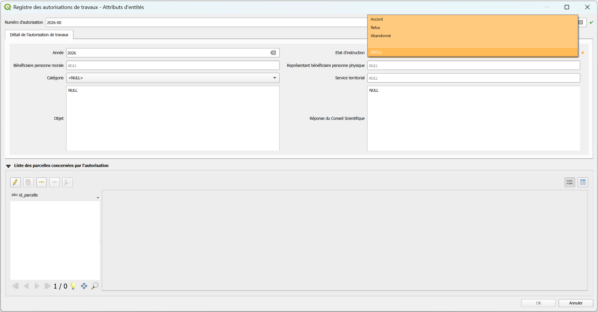

- **_Numéro d'autorisation_** : format YYYY-xxxx
- **_Année_** : renseignée automatiquement à partir du numéro d'autorisation
- **_Etat d'instruction_** : obligatoire de le renseigner
- **_Catégorie_** : liste de valeurs pré-définies à étoffer si besoin
- Les autres champs sont facultatifs et libres de formats.

#### Associer une parcelle à une autorisation
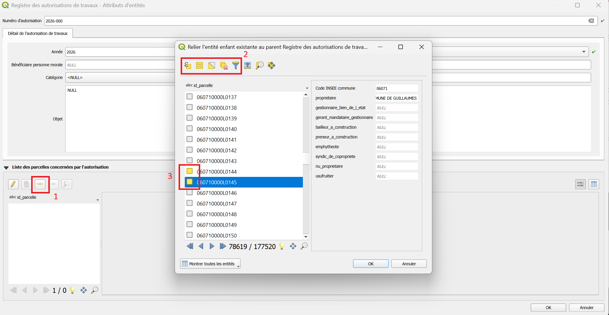

Dès lors que le numéro d'autorisation est correctement renseigné, il est possible de lier une ou plusieurs parcelles à celle-ci. Depuis la même fenêtre, cliquer sur l'outil "lier les entités enfants existantes" - étape 1 de l'image ci-dessus.  
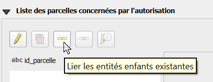

Le cadastre se charge, une nouvelle fenêtre s'ouvre avec la liste des identifiants de parcelles. Pour savoir si une parcelle sera bien ajoutée à votre saisie, il faut que le carré soit coloré (jaune/orange) devant l'identifiant de la parcelle :
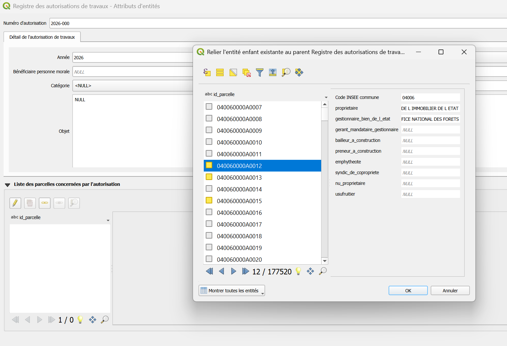
Si vous aviez sélectionné en amont les parcelles sur la carte, celles-ci seront déjà colorées et ajoutées si vous cliquer simplement sur OK une fois cette fenêtre ouverte.  
Vous devriez alors obtenir l'affichage ci-dessous.
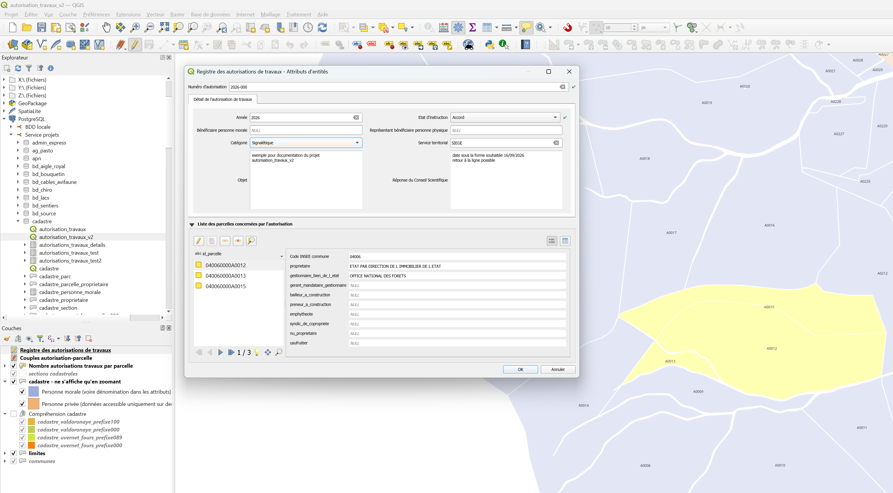

#### Consulter le registre des autorisation de travaux 
Cliquer sur la couche ```Registre des autorisations de travaux``` et ouvrez la table d'attributs.  

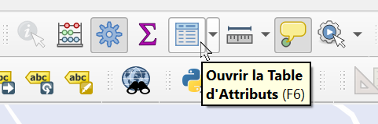

Par défaut, les numéros d'autorisation sont affichés dans l'ordre croissant, vous pouvez les ordonnancer de manière décroissante.

#### Modifier une association 'autorisation - parcelle'
Placer vous en mode édition. Ouvrez la table d'attributs de la couche ```Registre des autorisations de travaux```.  
Cliquer sur l'autorisation à modifier.  
Sélectionner le·s identifiant·s de parcelle que vous ne souhaitez plus voir associé·s à ce numéro d'autorisation (carré coloré devant l'identifiant) et cliquer sur l'outil "détacher entité(s) enfant sélectionnée" :  

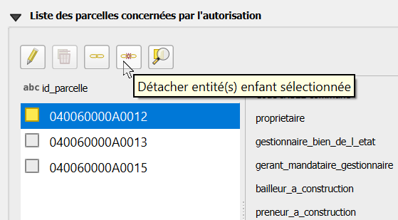


#### Supprimer une autorisation 
!!! warning "Point de vigilance"
    En supprimant une autorisation, toutes les associations 'autorisation-parcelle' seront supprimées aussi. Les données renseignées à propos de l'autorisation ne seront pas récupérables, sauf à "ne pas enregistrer les modifications" apportées.

En mode édition, ouvrez la table d'attribut de la couche ```Registre des autorisations de travaux```, et cliquer droit sur l'autorisation à supprimer > "Supprimer l'entité".


### Règles sur le cadastre

#### Identifiant de parcelles
Les identifiants de parcelles ont un format fixe. Ils sont composés de plusieurs numéros et lettres permettant d’identifier successivement le département, la commune, un préfixe (utile dans le cas de communes fusionnées), la section et un numéro de plan.  
Il permet de réaliser des jointures entre les différentes données mentionnant des parcelles.  
Le strict respect de ce format est nécessaire pour s’assurer que les données géométriques (tracés de parcelles) sont bien associées aux données attributaires (numéros d’autorisation).  

|Département|Commune|Préfixe|Section|Numéro de plan|
 |:--:|:--:|:--:|:--:|:--:|
 |_2 caractères_|_3 chiffres_|_3 chiffres_|_2 caractères_|_4 chiffres_|
 |06|114|000|0A|0262|

Par défaut le préfixe est fixé à `000` sur toutes les communes.  
Néanmoins, dès lors qu'une fusion de commune a lieu, les préfixes doivent être distingués pour identifier chaque parcelle distinctement : sinon on aurait 2 parcelles portant le même identifiant dès lors que le code de commune est rendu unique sur 2 communes. 

#### Aide à la compréhension du cadastre
Deux communes sur le Parc national du Mercantour ont été concernées par une fusion :  

- **Val d'Oronaye** : préfixes `000` et `100`
- **Uvernet-Fours** : préfixe `000` et `089`

Pour identifier où se trouvent les parcelles concernées par les différents préfixes, 4 couches ont été ajoutées dans le projet ```autorisation_travaux_v2```. Elles sont à afficher au besoin.
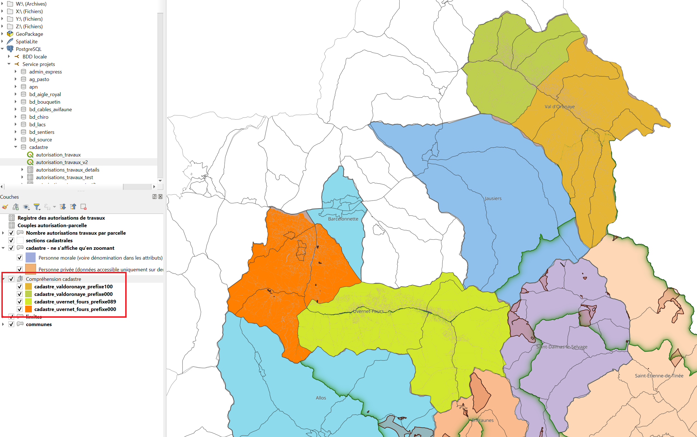

#### Code INSEE des communes
X:\2.2. INSTRUCTION ET POLICE\04_INSTRUCTION\11_Travaux\Recap pour SIG\Communes codes INSEE.ods

??? Note "Construction du projet (admin)"
    ### Documentation administrateur

    #### Traitement tableur vers bdd
    Historiquement, le registre des autorisations était synthétisé dans un tableau Excel. Il est donc possible qu'on ait à transférer ces données vers la bdd pour n'utiliser à terme qu'un unique outil : Qgis.

    Pour uniformiser la structure et automatiser l'écriture des ID parcelle complet pour suivre les [règles](#identifiant-de-parcelles) établies - fonction ```format_id_parcelle```, le code [`export_csv_autorisation_travaux`](https://github.com/PnMercantour/donnees/tree/main/docs/projets_qgis/scripts) permet d'obtenir 2 csv qui alimenteront la bdd, et des compléments d'infos sur les écarts à traiter pour que les données soient exploitables dans la bdd.

    #### Propriétés du projet
    Les paramètres concernant les _sources de données_ ont été adaptés à notre besoin :

    - **Groupe de transactions mises en mémoire tampon** : assurer la modification de la bdd en une seule requête malgré la modification de plusieurs couches + optimise les performances en réduisant les AR avec le SGBD.
    - **Évaluer les valeurs par défaut depuis le fournisseur de données** : assure la cohérence entre saisie et insertion réelle puisqu'il récupère en temps réel les valeurs générées côté base (séquences, identifiants, horodatages). 
    - **Lecture seule** : vérouille les données n'ayant pas vocation à être modifiées - cadastre, limites, ... même si les droits sont normalement gérés au plus haut niveau.

    #### Droits
    Groupe `cdm_cadastre` libre droits de lecture, modifications, insertions et suppressions.
    Groupes `consult_bati` et `pnm_consult` accès en lecture uniquement.

    #### Construction du formulaire
    Le formulaire permet à l'utilisateur, depuis la couche `Registre des autorisations de travaux`, de : 

    - créer, modifier ou supprimer une autorisation de travaux et l'ensemble de ses infos descriptives ;
    - lier cette autorisation à une ou plusieurs parcelles cadastrales, directement depuis le même formulaire, sans avoir à changer de couche.

    Cela repose sur l'imbrication de deux relations, issues des Foreign Keys structurant la BDD.  
    On les retrouve dans l'onglet `Relations` du projet :    
    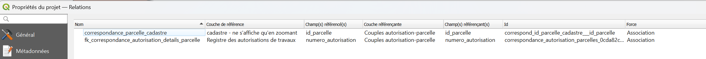

    La couche `Couples autorisation-parcelle` joue le rôle de table pivot : chaque enregistrement associe un `numero_autorisation` à un `id_parcelle`, ce qui permet une relation One-To-Many, sans dupliquer les données descriptives de l'autorisation.  
    On utilise donc cette relation pour configurer le champ `id_parcelle` avec l'outil **Référence de la relation**. Ainsi, seules les parcelles connues peuvent être associées à une autorisation, l'utilisateur peut rechercher directement dans le cadastre la parcelle, utiliser les outils de sélection. 

    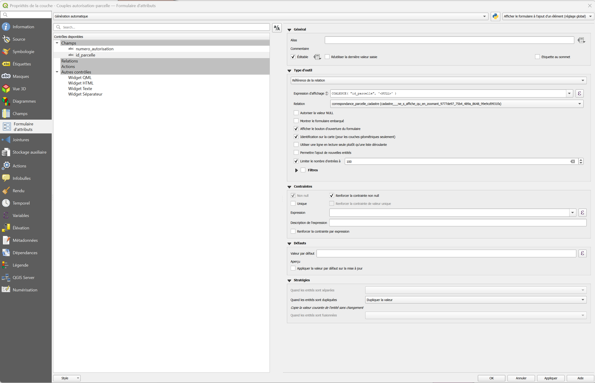

    Pour faciliter le cheminement de l'utilisateur, les deux sections sont affichées dans un unique formulaire : 
    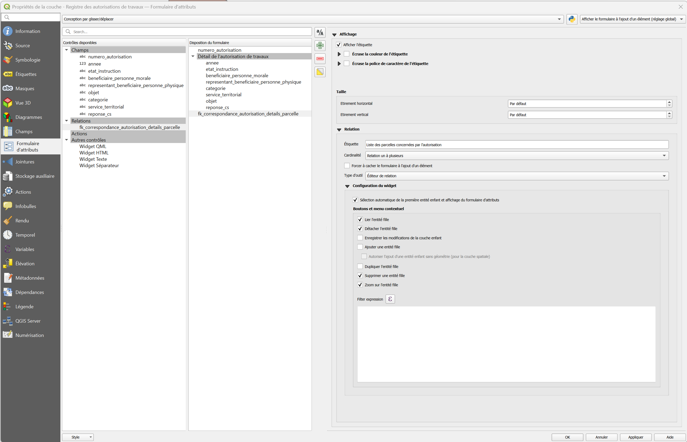

