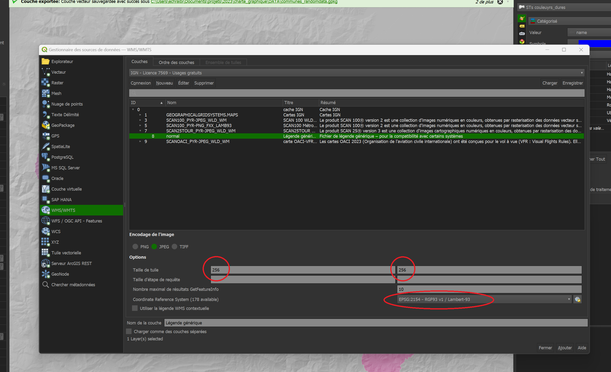

# Ajout fond SCAN25
Dans le cadre de la bascule des ressources de l'IGN, le SCAN 25 est temporairement accessible selon la démarche décrite ci dessous.

<!--  https://geoservices.ign.fr/documentation/services/utilisation-sig/tutoriel-qgis/gpf-wms-wmts-donneesnonlibres 

Cette solution est temporaire, et cessera de fonctionner dès la fin de la bascule des ressources de l'ign sur la géoplateforme. Quand cela arrivera, le nouveau mode d'accès au SAN25 vous sera communiqué.
--> 

# Ajouter le SCAN 25 au catalogue WMS

## Pas à pas

### Ajout de la ressource catalogue de WMS

 
- Ouvrir le gestionnaire de sources de données (Onglet "Couche>Gestionnaire de source de données" ou CTRL+L). 

- Cliquer sur WMS/WMTS dans l'explorateur, sélectionner "Nouveau" 

- Dans nom entrer "Scan 25"
- Dans URL copier le lien suivant
> https://data.geopf.fr/private/wmts?SERVICE=WMTS&VERSION=1.0.0&REQUEST=GetCapabilities&apikey=ign_scan_ws

<!--
- Il faut ensuite cliquer sur la petite croix verte dans l'encadré "Athentification"

- Puis entrer les données comme dans l'image ci dessous après avoir cliqué à nouveau sur la petite croix verte: 
	- Nom: Scan25
	- clé d'en-tête: apikey
	- Valeur d'en-tête: ign_scan_ws

--> 
- Cocher la case "Ignorer les URI GetMap/GetTile/GetLegendGraphic signalés dans les capacités"

-  Puis cliquer sur OK. 

- Un nouvel onglet s'ouvre automatiquement vous permettant de choisir entre plusieurs versions du scan 25, choisir celui projeté en Lambert-93 (EPSG:2154)

- Cliquer sur "Ajouter" en bas à droite pour ajouter cette couche WMS au projet actuel.

- Cette couche est maintenant disponible pour être chargée dans tous vos projets.

### Charger un fond de carte dans un projet QGIS

- Lancer QGIS
 
- Ouvrir le gestionnaire de sources de données (Onglet "Couche>Gestionnaire de source de données" ou CTRL+L). 

- Cliquer sur l'onglet "WMS" dans la colonne à gauche de la fenêtre.

- Cliquer sur la ressource d'intérêt dans le menu déroulant (ici "SCAN 25") puis sur "Charger"
- Cliquer sur la couche qui s'affiche dans le menu central
- Entrer des tailles de tuile (recommandé: "256" et "256".) Le système de coordonnées n'est pas toujours modifiable.

- puis sur "Ajouter"

