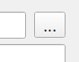

# Editeur d'Expressions

## Explications

Dans une couche au format [vecteur](./README.md#vecteur), il est possible de faire des recherches selon différents paramètres (exemple: "tous les polygones plus petits qu'1 ha", "toutes les communes commençant par la lettre 'C' " , etc...).

Nous verrons ici comment appliquer ces conditions et une fois la sélection réalisée comment visualiser, enregistrer ou exporter ces résultats. 
 
 
## Pas à pas

On retrouve l'éditeur d'expression à différents endroits de QGIS dont notablement:
- la sélection par expression
- la calculatrice de champs
- _utilisation avancée_ : automatisation de valeurs prises pour des paramètres spécifiques (exemple: taille de police conditionnée à l'échelle de la carte)

### Selection par expression

L'outil  "Selection par expression" peut se trouver à plusieurs endroits: 
- dans la barre d'outils principale
- dans la barre d'outils de la table d'attributs d'une couche 
- dans la boite à outils de traitements dans la catégorie "sélection dans un vecteur
 
Il est représenté par ce symbole:   

Une fois qu'on l'ouvre, il donne accès à l'éditeur d'expression tel qu'il peut apparaitre à différents endroits de QGIS. 

### L'éditeur d'expression

 

Il est séparé en 3 panneaux: 
- à gauche il s'agit de l'éditeur : là où on peut entrer et modifier l'expression
- au milieu un ensemble dd'opérateurs et variables sélectionnables qui sont regroupés par catégories
- à droite, un panneau qui donne des informations sur l'opérateur ou variable sélectionné dans le panneau central

### Construire une expression
Dans le cas d'une sélection par expression, il s'agit de vérifier que les valeurs d'une ou plusieurs colonnes répondent à des conditions. 
C'est-à-dire que l'expression entrée doit aboutir pour chaque entité à vérifier si une condition est vraie ou fausse (on peut aussi utiliser les valeurs 1 et 0 où 1=vrai et 0=faux)
Pour désigner la colonne d'une couche donnée, il faut donner son nom entouré de double-guillemets "" .

> "id" = 10
> ne sélectionnera que les entités où la valeur de la colonne "id" est égale à 10, puisque c'est la seule pour laquelle "id"=10 est vrai.

Les guillemets simples, eux, servent à désigner du texte: 

> "nom" = 'Beuil'  
> ne sélectionnera que les entités où la colonne "nom" contient exactement la chaîne de charactère 'Beuil'. Elle ne sélectionnera pas les entités avec 'beuil' ni ' Beuil ' comme nom (noter les espaces dans ce dernier exemple)

La manière la plus simple de ne pas se tromper est d'entrer les noms de colonnes en déroulant l'onglet "Champs et Valeurs" du panneau central, et en double-cliquant sur les colonnes nous intéressant. 
Elles seront directement copiées avec la mise en forme appropriée dans l'éditeur. 

De la même façon, une fois qu'un champ est sélectionné dans le panneau central, il est possible d'en vérifier les valeurs dans le panneau de droite.
En cliquant sur "Tous uniques" on affichera toutes les valeurs possibles de ce champ dans la couche. (A ne pas utiliser dans les couches trop grandes)
En cliquant sur "Echantillon de 10" on affichera 10 valeurs possibles que peut prendre ce champs. 

Avec ces outils, on peut déjà construire de nombreuses expressions correspondant à des conditions simples.

### Outils de expressions plus avancés

En utilisant l'éditeur d'expression il est aussi possible de construire des expressions plus complexes. 

On peut par exemple comparer des colones entre elles
 
> "aire_pastorale">"aire_forest" 
> permettra de ne sélectionner que les entités où la valeure dans la colonne "aire_pastorale" est supérieure à celle dans la colonne "aire_forest"

Ou se servir de fonctions comme $area:

> "aire_pastorale"> $area/2 va sélectionner les entités où la valeur dans "aire_pastorale" est supérieure à l'aire, dans l'unité de calcul d'aire définie dans le projet (en général: m², ce paramètre est modifiables dans les propriétés du projet, onglet "Général")

_Attention, $area et area sont deux fonctions différentes. $area renvoie à la superficie de chaque entité, tandis que area est une fonction qui s'applique à un objet donné_
>  exemple QGIS de l'utilisation d'area: area(geom_from_wkt('POLYGON((0 0, 4 0, 4 2, 0 2, 0 0))')) → 8.0

Il existe de nombreux outils que vous pouvez explorer comme les outils :
- "Chaînes de caractères" pour manipuler du texte (récupérez les premiers/derniers caractère d'un champs, changer la casse, ..)
- "Date et Heure" pour gérer l'information temporelle et les champs au format datetime
- "Géométrie" pour réaliser des opérations géométriques (vérifier des intersections, buffer, obtenir les distances entre entités...)
- ...

### Calculatrice de champs

L'éditeur d'expression apparait aussi quand on clique sur l'icône de la "calculatrice de champ" depuis une table d'attribut. 
Dans ce contexte, l'expression servira à déterminer la valeur que prendra une colonne nouvelle ou déjà existante

> $area
> permettra remplir automatiquement une colonne par l'aire de toutes les entités la composant dans l'unité de calcul d'aire définie dans le projet (en général: m²,  on pourra donc avoir : $area/10000 pour convertir en ha)

#### Les types de champs

En utilisant la calculatrice de champs, il faut être vigilant à ce que le type en sortie de l'expression corresponde bien au type de la colonne existante ou à créer. 
On peut les voir rapidement en déroulant l'onglet "Champs et Valeurs" du panneau central. On pourra ainsi distinguer les colonnes qui stockent: 
- des nombres entiers : elles sont précédées de "123"
- des nombres décimaux: elles sont précédées de "1.2"
- des chaînes de caractère: elles sont précédées de "abc"

Ces distinctions sont importantes car on ne peut pas réaliser les mêmes opérations sur chaque type. 
Essayer de stocker des valeurs dans un type dans une colonne d'un autre type peut causer des erreurs ou des pertes de précision. 

_Le fonctionnement est similaire à celui d'Excel: 22 sera considéré comme un nombre, tandis que '22' sera considéré comme une chaîne de caractères_

Il est possible de convertir de type "à la volée" dans les cas triviaux avec les fonctions de conversion

## Enregistrer une sélection

### Dans une nouvelle couche

Une fois la sélection réalisée en passant par l'éditeur d'expression, il est possible de créer simplement une nouvelle couche ne contenant que les entités sélectionnées en réalisant un clic droit sur la  couche où contenant les entités sélectionnées, puis 

<!--

### Créer une nouvelle couche. 
- Dans la barre des menus, Cliquer sur "Couche > Créer une couche > Nouvelle couche GeoPackage"
 

- Dans la fenêtre qui s'affiche, cliquer sur l'icône "..." pour renseigner l'emplacement où le fichier sera enregistré.
 

- Renseigner le type de géométrie selon le type d'usage voulu. Dans la plupart des cas: "Point", "Polyligne" ou "Polygone".
- Ne pas oublier d'indiquer la projection si elle est demandée: "EPSG:2154 - RGF v1 / Lambert-93"
- Si nécessaire, ajouter des champs. Il sera toujours possible d'en ajouter plus tard. 

### Activer le mode édition

- Activer le mode édition (2 façons possibles).

    Méthode 1 (_Recommandé_):  Sélectionner la couche à modifier, puis cliquer sur l'icône de crayon dans la barre d'outils en haut de l'écran  
 
	
    Méthode 2 :Cliquer droit sur la couche à modifier, puis en cliquant sur l'icône crayon "Basculer en mode édition"
 

- Une fois dans ce mode, un crayon apparait au-dessus du symbole de la couche..
 

- ..et des outils deviennent accessibles dans la barre d'outil. Ces outils sont regroupés dans les barres d'outils "Numérisation" et "Numérisation avancée".

- visibles en faisant un clic droit sur une des barres d'outils en haut de l'écran, ou bien dans la barre de menu "Vue > Barres d'outils > ..."

 

_A partir de là, différentes opérations sont disponibles, nous ne décrirons que les plus simples._

### Créer une nouvelle entité

- Proche de l'icone de crayon, dans la barre d'outils, se trouve l'icône "Ajouter une entité"

 

- Après avoir cliqué dessus, votre curseur change. Vous pouvez directement ajouter des points qui formeront, suivant le type de géométrie que votre couche contient
	- une entité par point
	- une partie de ligne ou de polygone
- Un clic gauche vous permet d'ajouter un point, un clic droit termine la saisie d'une entité sans en rajouter de nouveau, _donc pour faire un rectangle, il faut 4 clics gauches + 1 clic droit_.
- A chaque fin de saisie, une boite de dialogue s'ouvre, permettant d'entrer manuellement les attributs de l'entité. Dans la plupart des cas, vous n'êtes pas obligé d'entrer
quoi que ce soit, et pouvez simplement cliquer sur OK pour continuer la saisie. 

 

### Modifier la géométrie d'une entité existante

- L'outil sommet, disponible dans la barre d'outil numérisation à droite de l'outil d'ajout d'entité permet d'ajouter, supprimer, ou créer de nouveaux sommets.
 
- Une fois l'outil sommet sélectionné, on peut sélectionner n'importe quel sommet en cliquant dessus. Les sommets de chaque polygone sont visibles sous la forme de petits cercles rouges

 

- Après avoir sélectionné un sommet avec l'outil sommet, il est possible de le supprimer en appuyant sur la touche "Suppr" du clavier. 
- On peut aussi le déplacer, en cliquant à nouveau avec le clic gauche à un autre endroit après avoir sélectionné un sommet. 

- Enfin, il est possible de créer de nouveaux sommets dans un polygone en cliquant très précisément sur la croix qui apparait en faisant passer le curseur entre deux sommets. 
 

En combinant le déplacement, la modification, et la création de sommets, il est possible de changer complètement la forme d'un polygone.

_Tant que les modifications n'ont pas été enregistrées, elles ne sont pas définitives_

### Modifier les attributs d'une entité

- Une fois activé l'outil édition, il est possible d'éditer à la main les cases de la table attributaire. 
_On peut aussi activer le mode édition depuis la barre d'outils de la table attributaire._
 

-->

