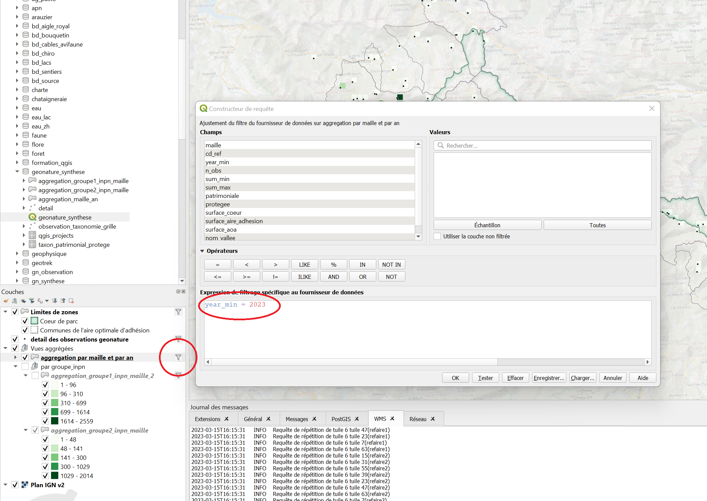

# Les Filtres dans QGIS

## Explication
Les filtres sont des outils permettant de limiter le nombre d'entités chargée dans QGIS selon des critères liées à la table d'attribut. 
Ils présentent l'avantage d'être appliqués au niveau du serveur, et donc limitent la charge mise sur votre machine.

## Pas à pas

Dans certain projets, ou au moment de charger certaines couches, vous pouvez voir cette icône: 

Elle signifique que la couche associée est filtrée. C'est-à-dire que seules les entités qui répondent aux conditions définies par la formule de filtrage sont visibles.

En cliquant sur l'icône de filtrage le constructeur d'expression de filtrage apparait. 

Effacer l'expression puis cliquer sur "OK" revient à enlever le filtre, et donc à afficher à nouveau toutes les entités présentes dans la couche. 

Vous pouvez aussi modifier le filtre.
L'expression consiste en une condition, il s'agit de vérifier qu'un ou plusieurs champs de chaque entité correspond aux critères choisis. 

La façon la plus simple, et la plus sûre, est de procéder en cliquant successivement sur les champs et les opérateurs choisis. 
(Il est possible d'écrire en toute lettre la requête, mais c'est s'exposer à plus de risques de faute de frappe ou de syntaxe, la moindre erreur rendant impossible l'exécution de la requête)

Il faut noter que les noms de champs sont à écrire entre " et les chaines de caractères entre '

par exemple, si dans une couche de départements on ne veut que le département des Alpes-Maritimes il faudrait écrire:

> "nom" = 'Alpes-Maritimes'

Il est possible d'écrire des requêtes plus ou moins complexes en combinant les conditions.
Par exemple si on veut toutes les observations datant au moins de 2022, ainsi que toutes celles du cd_ref: 4257 (quelle que soit la date d'observation).

> "date_min">2022 OR "cd_ref"=4257

De cette façon on peut combiner des conditions pour aboutir à des filtres complexes. 
par exemple pour filtrer pour n'avoir que les cd_nom correspondant à une liste donnée : 

> "cd_nom" IN (60313,60295,60418,60427,60400,79305,79301)

