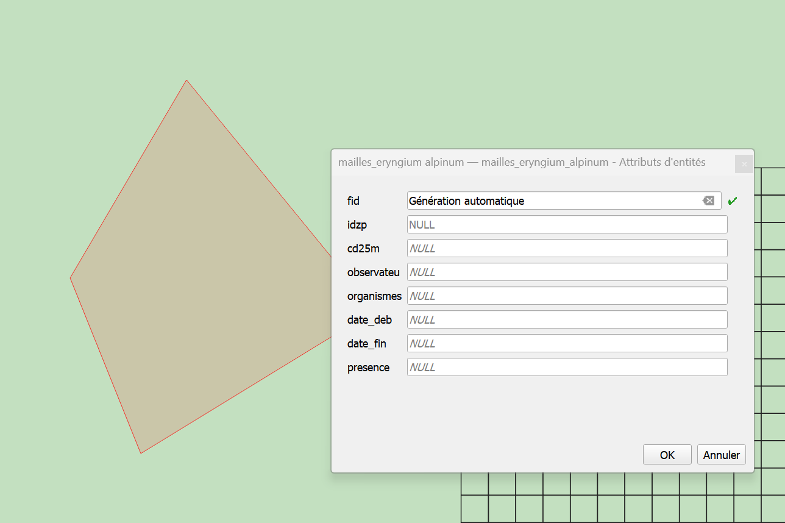
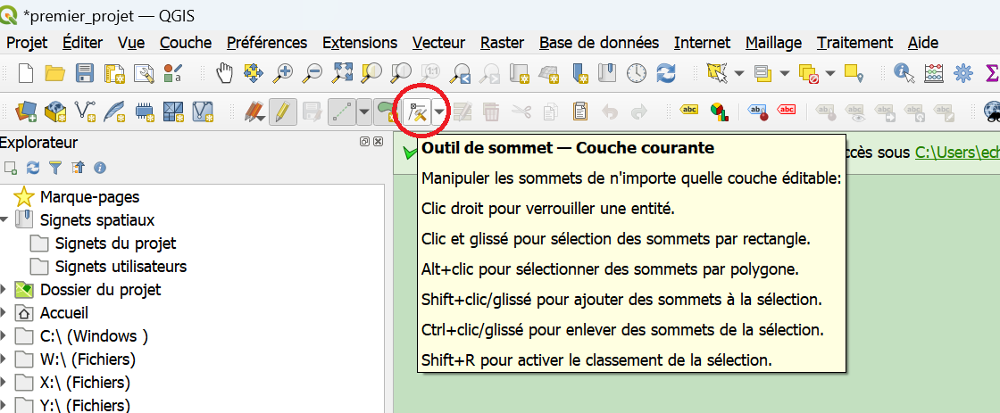

# Generation d'atlas.

## Explications

QGIS permet de générer des atlas. C'est-à-dire qu'il génère un ensemble de cartes avec la même représentation (symbologie) centrées sur des entités différentes d'une même couche.
On peut ainsi générer par exemple les cartes des environs des principales villes d'une région.

La condition principale étant que toutes les entités qui doivent apparaître sur l'atlas soient dans une même couche
 

 
 
## Pas à pas

### Ouvrir l'éditeur de cartes.

- En partant d'une carte existante, dans la barre de menu cliquer sur "Projet" puis "Gestionnaire de mise en page"

- Créer une nouvelle mise en page, ou utiliser une mise en page existante. 

Dans la fenêtre de mise en pâge, il faut d'abord activer les paramètres d'atlas. Pour ça: 
- dans la barre de menu, cliquer sur "Atlas" puis "Paramètres de l'atlas"

- Dans la barre de droite, apparait un onglet "Atlas" à côté de "Mise en page", "Propriétés de l'objet", et "Guides". Cocher la case "Générer un atlas"

- Dans le menu déroulant "couche de couverture", sélectionner la couche contenant les entités sur lesquelles devra être centré l'atlas. 

- Facultatif: Filter ou ordonner par un des champs de la couche de couverture. 

### Activer le mode édition

- Activer le mode édition (2 façons possibles).

    Méthode 1 (_Recommandé_):  Sélectionner la couche à modifier, puis cliquer sur l'icône de crayon dans la barre d'outils en haut de l'écran  
 
	
    Méthode 2 :Cliquer droit sur la couche à modifier, puis en cliquant sur l'icône crayon "Basculer en mode édition"
 

- Une fois dans ce mode, un crayon apparait au-dessus du symbole de la couche..
 

- ..et des outils deviennent accessibles dans la barre d'outil. Ces outils sont regroupés dans les barres d'outils "Numérisation" et "Numérisation avancée".

- visibles en faisant un clic droit sur une des barres d'outils en haut de l'écran, ou bien dans la barre de menu "Vue > Barres d'outils > ..."

 

_A partir de là, différentes opérations sont disponibles, nous ne décrirons que les plus simples._

### Créer une nouvelle entité

- Proche de l'icone de crayon, dans la barre d'outils, se trouve l'icône "Ajouter une entité"

 

- Après avoir cliqué dessus, votre curseur change. Vous pouvez directement ajouter des points qui formeront, suivant le type de géométrie que votre couche contient
	- une entité par point
	- une partie de ligne ou de polygone
- Un clic gauche vous permet d'ajouter un point, un clic droit termine la saisie d'une entité sans en rajouter de nouveau, _donc pour faire un rectangle, il faut 4 clics gauches + 1 clic droit_.
- A chaque fin de saisie, une boite de dialogue s'ouvre, permettant d'entrer manuellement les attributs de l'entité. Dans la plupart des cas, vous n'êtes pas obligé d'entrer
quoi que ce soit, et pouvez simplement cliquer sur OK pour continuer la saisie. 

 

### Modifier la géométrie d'une entité existante

- L'outil sommet, disponible dans la barre d'outil numérisation à droite de l'outil d'ajout d'entité permet d'ajouter, supprimer, ou créer de nouveaux sommets.
 
- Une fois l'outil sommet sélectionné, on peut sélectionner n'importe quel sommet en cliquant dessus. Les sommets de chaque polygone sont visibles sous la forme de petits cercles rouges

 

- Après avoir sélectionné un sommet avec l'outil sommet, il est possible de le supprimer en appuyant sur la touche "Suppr" du clavier. 
- On peut aussi le déplacer, en cliquant à nouveau avec le clic gauche à un autre endroit après avoir sélectionné un sommet. 

- Enfin, il est possible de créer de nouveaux sommets dans un polygone en cliquant très précisément sur la croix qui apparait en faisant passer le curseur entre deux sommets. 
 

En combinant le déplacement, la modification, et la création de sommets, il est possible de changer complètement la forme d'un polygone.

_Tant que les modifications n'ont pas été enregistrées, elles ne sont pas définitives_

### Modifier les attributs d'une entité

- Une fois activé l'outil édition, il est possible d'éditer à la main les cases de la table attributaire. 
_On peut aussi activer le mode édition depuis la barre d'outils de la table attributaire._
 

