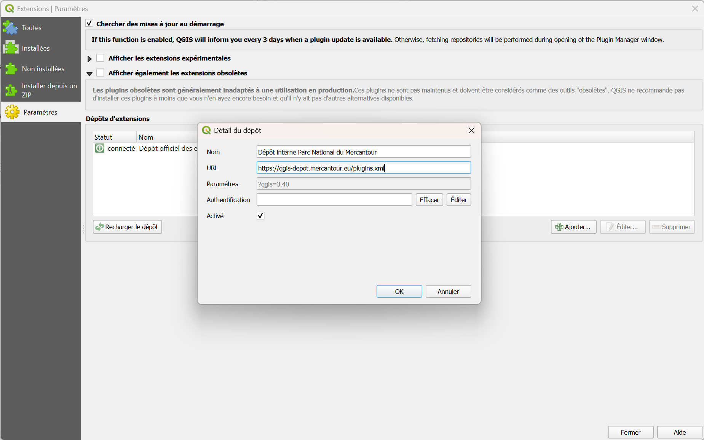

# Installation d’un plugin QGIS depuis le dépôt interne du Parc National du Mercantour

Cette documentation explique comment installer un plugin QGIS en utilisant le dépôt interne d'extensions mis en place par l'équipe SI du PNM.

---

## 1. Ouvrir le gestionnaire de plugins
- Dans QGIS, aller dans le menu **Extensions** > **Installer/Gérer les extensions…**

---

## 2. Ajouter le dépôt interne
1. Dans la fenêtre du gestionnaire d’extensions, cliquer sur l’onglet **Paramètres**.  
2. Cliquer sur le bouton **Ajouter…** dans la section *Dépôts d’extensions*.  
3. Renseigner les champs :
   - **Nom** : `Dépôt interne Parc National du Mercantour`  
   - **URL** : `https://qgis-depot.mercantour.eu/plugins.xml`

4. Cliquer sur **OK** puis vérifier que le statut du dépôt est bien **connecté**.

---

## 3. Rechercher et installer le plugin
1. Aller dans l’onglet **Toutes**.  
2. Chercher le plugin souhaité en utilisant la barre de recherche (ex. : *Analyse Survol*).  
3. Cliquer sur **Installer l’extension**.  

Le plugin est maintenant disponible dans votre QGIS.

---

## 4. Vérifier le fonctionnement
- Le plugin apparaît dans le menu ou la barre d’outils correspondante.  
- Vous pouvez également vérifier dans l’onglet **Installées** du gestionnaire d’extensions.

---

## Notes
- Le dépôt interne est mis à jour régulièrement. Pour obtenir la dernière version d’un plugin, pensez à cliquer sur **Vérifier les mises à jour**.
- Pour désinstaller une extension, aller dans l'onglet **Installées** puis sélectionner une extension et cliquer sur **Désinstaller**
- Il est possible de désactiver une extension depuis l'onglet **Installées**, décocher l'extension à désactiver 
- En cas de problème d’accès, assurez-vous que QGIS peut atteindre l’URL du dépôt (essayez d'accéder à `https://qgis-depot.mercantour.eu/plugins.xml` depuis un navigateur).  

---
