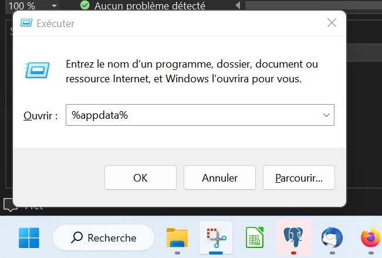
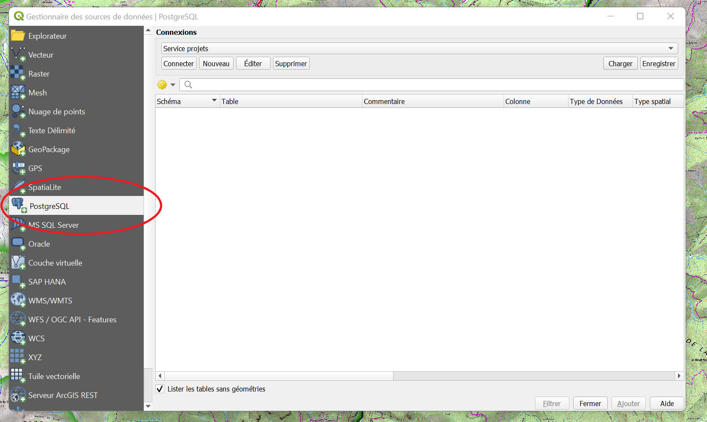
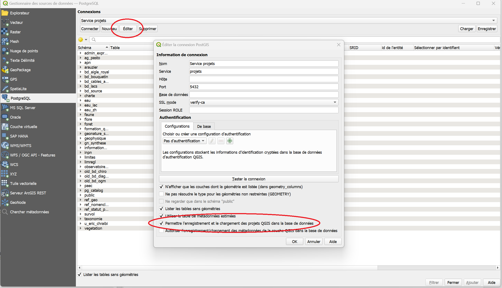

# Accès la base de données.


## Avant de commencer

 - _Vous avez reçu un fichier zip permettant le paramétrage de la connexion de la part du service informatique_
 - _Vous êtes bien sur une session windows qui n'est pas partagée._
 - _Vous pouvez charger les couches du projet "Strategie flore.qgz" - téléchargeable [ici](./ressources/Strategie_Flore.qgz)._


## Etapes de paramétrage à l'aide du fichier xml

- Télécharger le fichier zip 

<!-- Naviguer jusqu'au dossier AppData.

Il se trouve typiquement dans un chemin ressemblant à:
```
C:\Users\ *[nomdelasession]* \AppData\Roaming
```
Le façon la plus simple de l'atteindre consiste à appuyer sur  _touche windows + R_, 
puis à entrer la commande "%AppData%" dans l'invité de commande (la touche windows se trouve entre Ctrl et Alt). [Illustration](#Acces-au-dossier-AppData)

(Ce répertoire est masqué par défaut, il est aussi possible de naviguer jusqu'à lui, en autorisant
l'affichage des fichiers cachés dans les options)

- Créer un dossier "postgresql" dans le dossier AppData\Roaming s'il n'existe pas
- Copier dans ce dossier tous les fichiers du zip, y compris le fichier masqué .pg_service.conf
(les remplacer s'ils existent déjà)
-->
- Enregistrer et décompresser si nécessaire le fichier zip contenant le fichier "service projets.xml".

- Déplacer ce fichier dans un dossier où il sera facile à retrouver.
 
> Exemple: C:\Users\VotreNom\Documents\QgisXML


- Lancer Qgis

- Ouvrir le gestionnaire de sources de données (Onglet "Couche>Gestionnaire de source de données" ou Ctrl+L) [Illustration](#Gestionnaire-de-sources-de-donnees)

- Cliquer sur PostgreSQL dans la barre de gauche

- Cliquer sur "charger" et retrouver le fichier "service projets.xml" que vous venez de copier

- Vérifier que la connexion "Service projets" est disponible, et se connecter

_La liste des tables et schémas accessibles devraient apparaître._

_Vous pourrez aussi directement charger des projets directement depuis:_
> Projet > Ouvrir depuis... > PostgreSQL

_Puis en choisissant la connexion "Service projets" et le schéma concerné._


____
## FAQ
> Je ne vois pas les projets, mais seulement les tables de la base de données

 Faire un clic droit sur Postgis/Service Projets dans l'explorateur, cliquer "Editer la connexion" et cocher "Permettre le chargement et l'enregistrement de projets QGIS" puis "OK".
 [Illustration](#Autoriser-le-chargement-des-projets)
____

## Illustrations

<!--

### Accès au dossier AppData



_Après avoir appuyé sur la touche WINDOWS+R , la fenêtre "Exécuter" apparait_
-->
### Gestionnaire de sources de donnees
 


 

_Le gestionnaire de données est le moyen à privilégier pour importer des données au projet courant._

_(Les autres façons d'ajouter des couches peuvent créer des problèmes en appliquant des paramètres d'import par défaut)_

### Autoriser le chargement des projets

 
