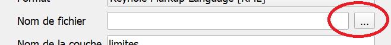

# F.A.Q.

_Vous trouverez dans ce fichier une liste de problèmes et questions fréquentes avec des solutions simples._

_En cliquant en haut à droite de cette fenêtre vous avez accès à la table des matières pour chercher directement la question qui vous intéresse_

<!-- ## Recherche de données -->

<!-- ### Je souhaite importer des courbes de niveau dans mon projet Qgis. --> 

## Dans QGIS

### Qgis plante quand j'essaie d'ouvrir la table d'attribut d'une couche
_Il est probable que la table que vous essayer d'ouvrir est trop grande pour être gérée par Qgis._
_Solution: Limiter le nombre d'entités affiché par défaut dans la table d'attributs_
Dans la barre d'outils cliquer sur :
> Préférences > Options...
Dans les onglets de gauche, cliquer sur "Sources de données", puis dans "Comportement des tables" choisir "Montré les entités visibles sur la carte".

Dorénavant, la table d'attribut ne montrera que les entités visibles sur l'étendue du canevas visible, en zoomant vous limiterez le nombre d'entités à charger dans la table d'attribut et donc
le risque de plantage de Qgis. 

### La table d'attribut d'une couche ne montre pas toutes les entités. 

_Si vous êtes sûr que votre couche contient un grand nombre d'entités, mais seules quelques unes, voire aucunes
ne sont visibles dans la table d'attribut._
_Solution: Autoriser une couche à afficher toutes ses entités dans la table d'attributs._
En bas à droite de de la fenêtre de la table d'attributs se trouve une petite icône avec un menu déroulant "Ne montrer que les entités visibles sur la carte", 
vous pouvez choisir à la place l'option "Montrer toutes les entités" si vous savez que la taille de la table d'attributs n'est pas trop grande pour la mémoire de votre machine. 

_Vous pouvez aussi vérifier le nombre d'entités contenu dans une couche en passant par:_
> clic droit sur la couche > Propriétés > Information : Décompte d'entités_
_Si ce nombre ne correspond pas au nombre d'entités dans la table d'attribut vous pouvez appliquer la solution ci-dessous._ 

#### Explication
Qgis est paramétré par défaut pour ne montrer que les entités de la table d'attribut qui sont visibles sur la carte. 
Cela évite de faire planter instantanément Qgis en essayant de charger une table d'attribut contenant des milliers d'entités,
comme il en existe sur le serveur. 

### Message d'erreur " L'entité ...  a une géométrie non valide" pendant un géotraitement
Même si elles ne sont pas formulées, les géométries dans Qgis répondent à des règles. Une entité invalide peut tout de même être affichée, mais
toute tentative de traitement, ou de jointure avec une autre couche renverra cette erreur. 

_Solution_

- > "Réparer les géométries": dans la boîte à outil de Qgis se trouve un outil "Réparer les géométries" qui peut tenter de réparer les erreurs de géométries.

- > Modification manuelle: Si le message d'erreur donne les identifiants des entités aux géométries incorrectes, il est possible de les examiner et 
modifier manuellement pour corriger les éventuelles erreurs. 

### Impossible de charger un projet depuis la base de données PostgreSQL
Il existe plusieurs cas de figures:

- 1. Vous ne disposez pas d'un accès à la base de données

_Solution_

> Si vous êtes bien sur votre poste de travail, et c'est la première fois que vous vous connectez à la base de données contacter le SI.

- 2. Vous pouvez charger des couches depuis la base de données en passant par le gestionnaire de sources de données

_Solution_

> Dans le Gestionnaire des sources de données (Onglet "Couche > Gestionnaire des sources de données" ou CTRL + L), sélectionner l'onglet "PostgreSQL". Puis sélectionner la connexion "Service projets". Enfin, cliquer sur "Editer". 
Une nouvelle fenêtre s'affiche en bas de laquelle se trouve la case à cocher "Permettre l'enregistrement et le chargement de projets QGIS dans la base de données. "

### Je ne vois plus le panneau couches/explorateur/...
Le plus probable est qu'un panneau ait été déplacé/fermé dans une mauvaise manipulation. 
Pour le faire réapparaître, il suffit de cliquer sur 
> Vue>Panneaux
Puis de cocher les cases d'intérêt (généralement: Couches/Boîtes à Outils de traitements/Style de couche)

### Je ne vois pas les projets, mais seulement les tables de la base de données

 Faire un clic droit sur Postgis/Service Projets dans l'explorateur, cliquer "Editer la connexion" et cocher "Permettre le chargement et l'enregistrement de projets QGIS" puis "OK".
 
	

## Oruxmaps

### charger une couche dans Oruxmaps

Pour rendre une couche accessible dans Oruxmaps, il est nécessaire de produire un fichier au format kml de cette couche, puis de la charger dans le téléphone. 

- Dans Qgis, charger la couche d'intérêt. 
- Cliquer droit sur la couche "Exporter> Sauvergarder les entités sous....."
- Choisir le format Keyhole Markup Language (KML)
- Parcourir les dossiers en cliquant sur l'icône suivant, et enregistrer le fichier là où il sera facile à retrouver.
 
- Brancher le portable ou la tablette à l'ordinateur. 
- Copier le fichier KML dans le dossier 
> ...> oruxmaps > overlay
- Ouvrir Oruxmaps, ouvrir les options de cartes, 
 
- Ouvrir "Options des couches" puis "Charger une couche KML"
Vous devriez trouver le fichier kml, et pouvoir le sélectionner pour le charger. 

