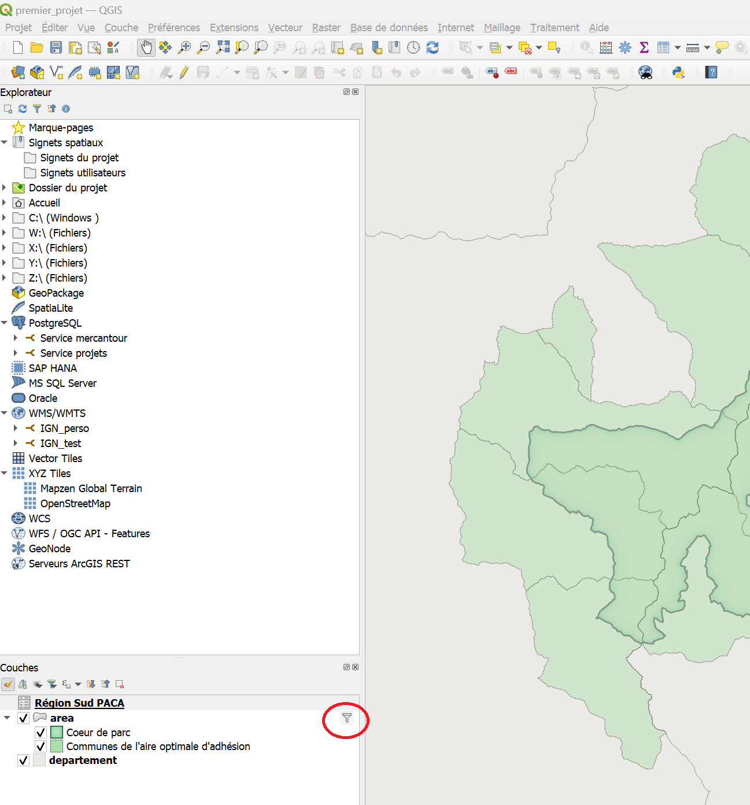
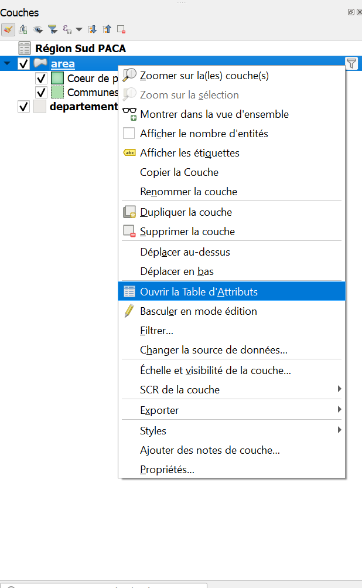

# Mon Premier projet

_Vous avez reçu des la confirmation du SI que vous êtes autorisé à utiliser la base de données du parc ? Voilà comment faire !_

_Ce tutoriel contient les étapes pour la consultation d'un projet existant, ainsi que les possibles opérations à réaliser pour en faciliter la visualisation._

> Scénario: On vous a demandé d'établir pour certaines zones la présence ou l'absence d'une espèce végétale donnée. 
> 
> Pour cela, vous devez consulter un projet Qgis, faire vos relevés terrains, puis entrer les résultats en modifiant une couche existante.

## Accès à la base de données
_Cette partie reprend le processus décrit dans [ce tutoriel](./Acces_BD.md)._
### 1. Vérifier que vous avez bien accès à la base de données par Qgis. 

Pour cela vous pouvez télécharger le projet à [ce lien]() et tenter de le lancer. Si les couches s'affichent bien, vous pouvez continuer,
sinon contacter le SI. 

### 2. Charger l'ensemble des connexions

Vous devez aussi avoir reçu un fichier zip permettant le paramétrage de la connexion de la part du service informatique.

Enregistrer et décompresser si nécessaire ce fichier zip contenant le fichier "service projets.xml".

Déplacer ce fichier dans un dossier où il sera facile à retrouver.
 
> Exemple: C:\Users\VotreNom\Documents\QgisXML

Une fois Qgis lancé, vous pouvez ouvrir le gestionnaire de sources de données (Onglet "Couche>Gestionnaire de source de données" ou Ctrl+L) 

 

- Cliquer sur PostgreSQL dans la barre de gauche

 

- Cliquer sur "charger" et retrouver le fichier "service projets.xml" que vous venez de copier

- Vérifier que la connexion "Service projets" est disponible, et se connecter

_La liste des tables et schémas accessibles devraient apparaître._

_NB: Le gestionnaire de données est le moyen à privilégier pour importer des données au projet courant. (Les autres façons d'ajouter des couches peuvent créer des problèmes en appliquant des paramètres d'import par défaut)_

_Cette étape visait à vérifier la connexion à la base de données. Maintenant nous allons charger effectivement des données._

### 3. Charger le projet d'intérêt

Pour cela, cliquer sur l'onglet projet en haut à gauche de la fenêtre Qgis: Projet>Ouvrir Depuis>PostgreSQL

 

Ensuite vous aurez accès à la liste des serveurs disponibles. 
Ici, il s'agit du projet "Mon premier projet" dans le schéma "tutos".

## Visualisation des données du projet
_Vous avez bien réussi à charger le projet "MonPremierProjet" et voyez des couches, nous allons maintenant passer en revue 
les moyens de naviguer dans le projet et observer les données._

0. Enregistrer le projet en local

Vous pouvez à tout moment "enregistrer sous" un projet qui est enregistré sur le serveur. 
Cela en crée une copie qui ne sera plus accessible qu'à vous, 
mais que vous pourrez modifier sans risquer de perdre le travail de vos collègues.

1. Afficher/masquer des couches

_Dans Qgis, la position de la plupart des éléments est personnalisable, et il arrive qu'on les modifie par accident. 
Auquel cas on pourra les retrouver dans l'onglet "Vue", et vérifier que le panneau ou la barre d'outils concernée est bien visible._

 

A gauche de chaque couche se trouve une petite boite qui peut être cochée ou décochée. 
Cette boite permet d'afficher ou de masquer chaque couche, ou élément de symbologie d'une couche.

2. Les propriétés

Double cliquer sur une couche, ou faire "clic droit > Propriétés" en affiche les propriétés. 

_**Le détail de la table attributaire n'est pas visible dans les propriétés**_

Là vous avez accès à une série d'onglet donnant des informations sur la couche en question. 
L'onglet "Information" est particulièrement important pour:
- vérifier la source des données (si vous travaillez sur des données stockées sur votre machine, le chemin détaillé vers le fichier apparaitra, 
si vous travaillez sur le serveur ce seront les paramètres de connexion qui seront visibles).
- vérifier le type de données ( raster/vecteur, type de géométrie) et la projection
- vérifier le décompte d'entité (il s'agit du décompte après application du filtre)

3. Les filtres

Vous pouvez remarquer un symbole :  
 à droite de certaines couches:

 

Il signifie que la couche en question est filtrée. Les filtres sont des outils très puissants, notamment pour limiter la charge sur vos ordinateurs. 
Ils sont appliqués au niveau du serveur, et permettent de ne charger que les entités d'une couche que vous aurez choisies par une expression. 

Par exemple, en cliquand sur le symbole filtre de XXXXXX ou en faisant clic droit > Filtre sur cette couche vous voyez l'expression suivante :

qui signifie: 

_Certaines couches du serveur sont chargées par défaut avec des filtres. Il est tout à fait possible de les modifier pour accéder à d'autres données, 
ou de restreindre encore le filtre proposé_

<!--
_Les filtres sont aussi visibles en dans les propriétés d'une couche, à l'onglet "Source". Ce n'est pas très intuitif...._  
--> 

4. La table attributaire

Les couches au format vecteur (qu'est-ce que c'est?) contiennent une table attributaire, donnant des informations sur les données qu'elles contiennent. 
Vous pouvez visualiser cette table en cliquant droit sur la couche puis sur "Ouvrir la table d'attributs".

 

Il existe deux façons de représenter la table attributaire. Une vue "Table" et une vue "Formulaire". On peut basculer de l'une à 
l'autre en cliquant sur l'icone correspondante en bas à droite de la fenêtre. 

   

_A gauche, la table atributaire en format table. A droite,en format formulaire. Le mode table permet de visualiser d'un coup d'oeil l'ensemble des entités et attributs simultanément.
Le mode formulaire permet de visualiser et dles entités une à une, la liste des entités apparaissant sur la gauche._

## Modification d'une couche

<!--
### Autoriser le chargement des projets

  -->
