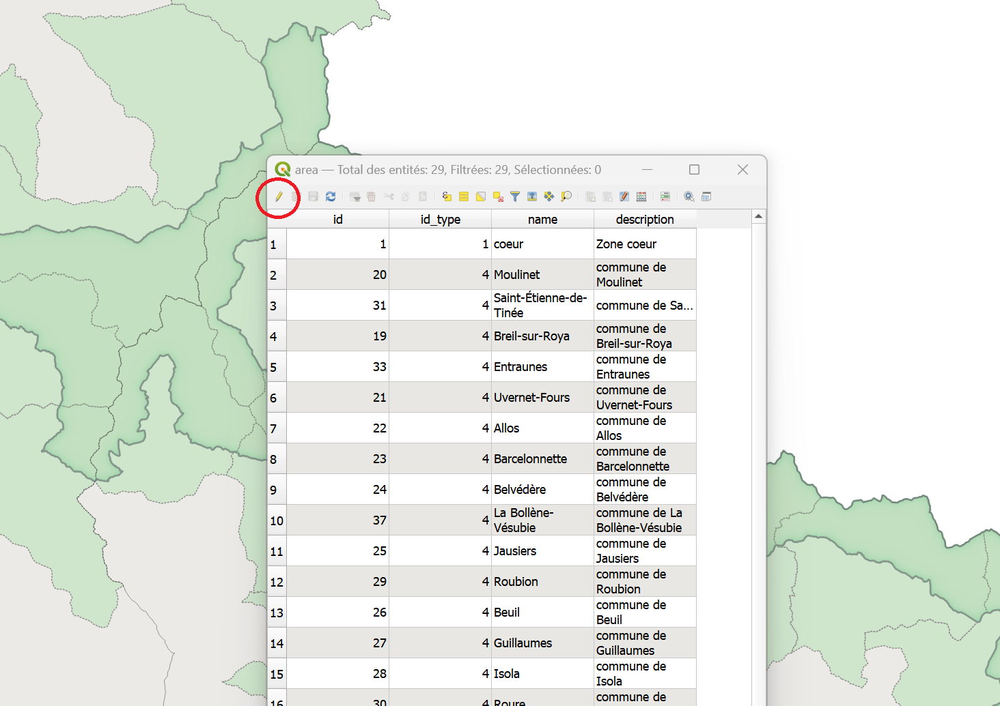
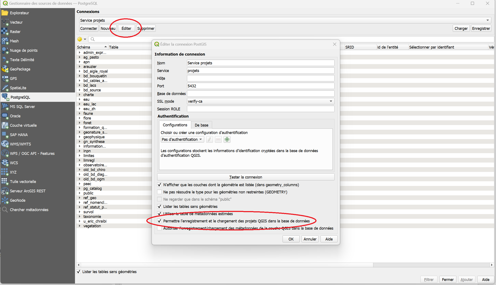

# Mon Premier projet

_Vous avez reçu des la confirmation du SI que vous êtes autorisé à utiliser la [base de données](./README.md#base-de-donnees) du parc ? Voilà comment faire !_


_Ce tutoriel contient les étapes pour la consultation d'un [projet Qgis](./README.md#projet "projet Qgis contient un ensemble de couches,
les informations permettant de les représenter, ainsi que l'ensemble des paramètres conditionnant la réalisation de géotraitements.") existant, ainsi que les possibles opérations à réaliser pour en faciliter la visualisation._

> Scénario: On vous a demandé d'établir pour certaines zones la présence ou l'absence d'une espèce végétale donnée. 
> 
> Pour cela, vous devez consulter un [projet Qgis](./README.md#projet "projet Qgis contient un ensemble de couches,
les informations permettant de les représenter, ainsi que l'ensemble des paramètres conditionnant la réalisation de géotraitements."), faire vos relevés terrains, puis entrer les résultats en modifiant une couche existante.


## Accès à la [base de données](./README.md#base-de-donnees)
_Cette partie reprend le processus décrit dans [ce tutoriel](./Acces_BD.md)._
### 1. Vérifier que vous avez bien accès à la base de données par Qgis. 

Pour cela vous pouvez télécharger le projet à [ce lien](./ressources/PremierProjet.qgz) et tenter de le lancer. Si les [couches](./README.md#couche "Dans un projet Qgis, une couche est une représentation de données spatialisée") s'affichent bien, vous pouvez continuer,
sinon contacter le SI. 


### 2. Charger l'ensemble des connexions

Vous devez avoir reçu un fichier zip permettant le paramétrage de la connexion de la part du service informatique.

Enregistrer, et décompresser si nécessaire, le fichier "service projets.xml".

Déplacer ce fichier dans un dossier où il sera facile à retrouver.
 
> Exemple: C:\Users\VotreNom\Documents\QgisXML


Une fois Qgis lancé, vous pouvez ouvrir le gestionnaire de sources de données (Onglet "Couche>Gestionnaire de source de données" ou Ctrl+L).

 


- Cliquer sur PostgreSQL dans la barre de gauche

 

- Cliquer sur "charger" et retrouver le fichier "service projets.xml" que vous venez de copier


- Vérifier que la connexion "Service projets" est disponible, et se connecter

_La liste des [tables et schémas](./README.md#schema) accessibles devraient apparaître._


_NB: Le gestionnaire de données est le moyen à privilégier pour importer des données au projet courant. (Les autres façons d'ajouter des couches peuvent créer des problèmes en appliquant des paramètres d'import par défaut)_

_Cette étape visait à vérifier la connexion à la base de données. Maintenant nous allons charger un [projet](./README.md#projet), qui regroupe des données et leur représentation._

### 3. Charger le projet d'intérêt

Pour cela, cliquer sur l'onglet "Projet" en haut à gauche de la fenêtre Qgis: Projet>Ouvrir Depuis>PostgreSQL

 

Vous aurez ensuite accès à la liste des serveurs disponibles. 
Pour ce tutoriel, il s'agit du projet "Mon premier projet" dans le schéma "tutos".


## Visualisation des données du projet
_Vous avez bien réussi à charger le projet "MonPremierProjet" et en voyez le contenu. Nous allons maintenant passer en revue 
les moyens de naviguer dans le projet et observer les données._

0. Enregistrer le projet en local 

Vous pouvez à tout moment "enregistrer sous" un projet qui est enregistré sur le serveur. 
Cela en crée une copie qui ne sera plus accessible à personne d'autre que vous, 
mais vous pourrez ensuite le modifier sans risque de perdre le travail de vos collègues.


1. Afficher/masquer des couches

_Dans Qgis, la position de la plupart des éléments est personnalisable, et il arrive qu'on les modifie par accident. 
Si ça arrive, cas on pourra les retrouver dans l'onglet "Vue", et vérifier que le panneau ou la barre d'outils concernée est bien visible._


 

A gauche de chaque couche se trouve une petite boite qui peut être cochée ou décochée. 
Cette boite permet d'afficher ou de masquer chaque couche, ou élément de symbologie d'une couche.


2. Les propriétés

Double cliquer sur une couche, ou faire "clic droit > Propriétés" en affiche les propriétés. 

_**Le détail de la table attributaire n'est pas visible dans les propriétés.**_

Là vous avez accès à une série d'onglet donnant des informations sur la couche en question. 
L'onglet "Information" est particulièrement important pour:
- vérifier la source des données (si vous travaillez sur des données stockées sur votre machine, le chemin détaillé vers le fichier apparaitra, 
si vous travaillez sur le serveur ce seront les paramètres de connexion qui seront visibles).
- vérifier le type de données ( raster/vecteur, type de géométrie) et la projection
- vérifier le décompte d'entité (il s'agit du décompte après application du filtre)


3. Les filtres

Vous pouvez remarquer un symbole :  
 à droite de certaines couches:


 


Il signifie que la couche en question est filtrée. Les filtres sont des outils très puissants, notamment pour limiter la charge sur vos ordinateurs. 
Ils sont appliqués au niveau du serveur, et permettent de ne charger que les entités d'une couche que vous aurez choisies par une expression. 

Par exemple, en cliquant sur le symbole filtre de "area" ou en faisant clic droit > Filtre sur cette couche vous voyez l'expression suivante :
```sql
"name"='coeur' OR "id_type"=4
```

qui signifie: 
"Ne charge que les entités pour lesquelles la colonne "name" contient la chaîne de caractères 'coeur' 
ou bien celles pour lesquelles la colonne 'id_type' contient la valeur 4.
"


_Certaines couches du serveur sont chargées par défaut avec des filtres. Il est tout à fait possible de les modifier pour accéder à d'autres données, 
ou de restreindre encore le filtre proposé le temps de la consultation du projet. Dans ce cas, veillez cependant à ne pas enregistrer vos modifications sur un projet partagé._

_Les projets devraient être conçus de façon à ce que vous n'ayez pas à manipuler les filtres. Néanmoins, vous êtes encouragés à apprendre à les utiliser.
Les filtres emploient une syntaxe SQL et un [tutoriel](lienavenir) dédié sera créé._

<!--
_Les filtres sont aussi visibles en dans les propriétés d'une couche, à l'onglet "Source". Ce n'est pas très intuitif...._  
--> 

4. La table attributaire

Les couches au format [vecteur](./README.md#vecteur "En géomatique, un vecteur est l'un des deux modes principaux de représentation des données spatiales. 
") contiennent une [table attributaire](), donnant des informations sur les données qu'elles contiennent. 
Vous pouvez visualiser cette table en cliquant droit sur la couche puis sur "Ouvrir la table d'attributs".

 


Il existe deux façons de représenter la table attributaire. Une vue "Table" et une vue "Formulaire". On peut basculer de l'une à 
l'autre en cliquant sur l'icone correspondante en bas à droite de la fenêtre. 


   

_A gauche, la table atributaire en format table. A droite,en format formulaire. Le mode table permet de visualiser d'un coup d'oeil l'ensemble des entités et attributs simultanément.
Le mode formulaire permet de visualiser et les entités une à une, la liste des entités apparaissant sur la gauche._


## Editer d'une couche

_On se concentrera sur les couches au format [vecteur](bonjourcestunlien.xml). Toutes les couches présentes dans le projet tuto sont dans ce format. 
Il existe des méthodes pour modifier les [rasters](autrelien), mais nous ne les aborderons pas ici._

Editer une couche Qgis modifie le fichier de source des données. Il est donc important rester prudent et garder une copie des données d'origine quand c'est possible. 
Pour réaliser des modifications ou créer une nouvelle entité, il faut d'abord activer le mode Edition pour la couche d'intérêt. Cela peut se faire de plusieurs façons: 

| |   |   |
|:--:|:--:|:--:|:--:|
|Dans la barre d'outils Qgis |En passant par un clic droit sur la couche|depuis la fenêtre de la table attributaire|

Dans tous les cas, cliquer sur le petit crayon activera le mode édition pour la couche sélectionnée. On pourra alors y apporter des modifications de différentes façon.
Ces modifications ne seront toutefois enregistrées et effectives qu'à la sortie du mode édition (en cliquant à nouveau sur le crayon). Si le logiciel crash, ou qu'on ne confirme 
pas les changements à la sortie du mode édition, les changements seront perdus et les données d'origine seront conservées. 

1. Modification de la table attributaire

Une fois en mode Edition, on peut modifier directement la table attributaire à la façon d'un tableur. 


2. Création d'entités/Modification de géométrie

En mode édition, on peut aussi éditer directement la géométrie d'une entité, ou en créer de nouvelles. 

| | |
|:--:|:--:|
|l'outil sommet permet de modifier la géométrie de points/lignes/polygones existants| Ajouter une entité permet de créer de nouvelles entités|


La création d'une nouvelle entité se fait par une succession de clics gauches, et est finalisée par un clic droit.
A la finalisation de chaque entité, une fenêtre s'ouvre proposant d'entrer les attributs connus. 

 

Un "id" ou "fid" correspondant à l'identifiant unique de chaque entité peut être généré automatiquement. 
Il n'est pas nécessaire d'entrer les autres attributs pour que la nouvelle enttité soit sauvegardée. 


<!--
### Autoriser le chargement des projets

  -->

## Changer le mode de représentation d'une couche

Dans couche on appelle le mode de représentation des données d'une couche la "symbologie" (exemple: des aplats de couleurs, cercles noirs pour des points, lignes vertes etc...)
Elle peut être modifiée de façon précise pour chaque couche en passant par les propriétés d'une couche, à l'onglet symbologie.

Les outils de symbologie dans Qgis sont très puissants, et permettent de représenter les informations d'une couche de façon synthétique.
On décrit ici les modes de représentation les plus communément utilisés:
- Symbole unique

Mode de représentation le plus simple. On définit un symbole qui sera appliqué de manière uniforme à toutes les entités, sans prendre en compte leurs attributs

- Catégorisé

Permet de représenter des différences qualitatives entre les entités. C'est-à-dire qu'un de leurs attributs permet de les différencier.
> Par exemple: pour des polygones représentant l'occupation des sols, le nom de ces catégories (forêt, culture, bâti etc...).

- Gradué

Permet de représenter des différences quantitatives entre des entités.
> Par exemple: pour des points représentant des villes, on peut faire varier leur taille pour représenter leur population. 


_Dans ce tutoriel nous n'irons pas plus loin sur la symbologie, mais un autre tutoriel lui sera dédiée. Nous vous invitons à faire des essais, tout en prenant soin 
de ne pas écraser la symbologie d'un projet partagé._


## Exporter une carte au format image

_Attention, de nombreux projets du Parc contiennent des données qu'il n'est pas possible de diffuser librement. 
Il est donc fortement suggérer de n'employer les exports que pour des utilisations internes._

1. Export simple

Il est possible de réaliser des exports directement depuis le menu de Qgis. A l'onglet Projet > Importer/exporter > Exporter au format Image
Cette façon de faire ne permet que d'exporter le contenu du canevas

 

Cet outil fait apparaitre un menu permettant de choisir l'emprise de l'export: 

 

On peut ainsi facilement exporter au format image la vue de la carte visible à l'écran. 


2. Mises en page

Qgis permet de réaliser des mises en pages de cartes plus complexes. Pour les réaliser, il faut passer par l'outil de mise en page de Qgis.

 

Si une mise en page a déjà été créée pour le projet en question, vous la trouverez ou bien dans le menu "Projet > Mise en page" ou bien
dans le Gestionnaire de mises en page.

Il est aussi possible de créer une nouvelle mise en page. 

Dans tous les cas, à l'ouverture d'une mise en page, une nouvelle fenêtre s'ouvre. 

