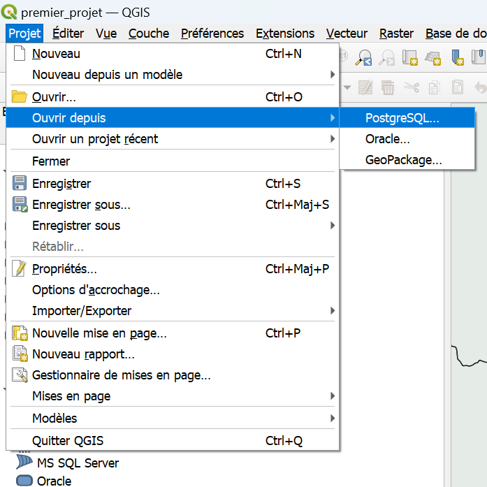
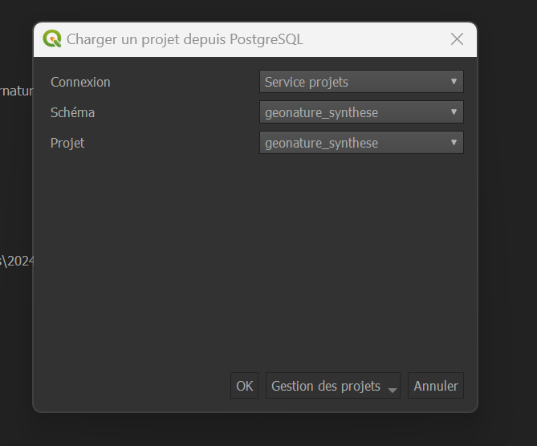
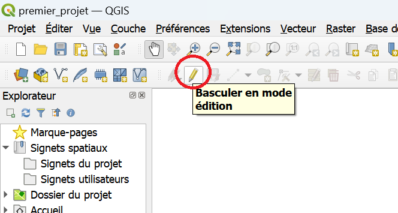
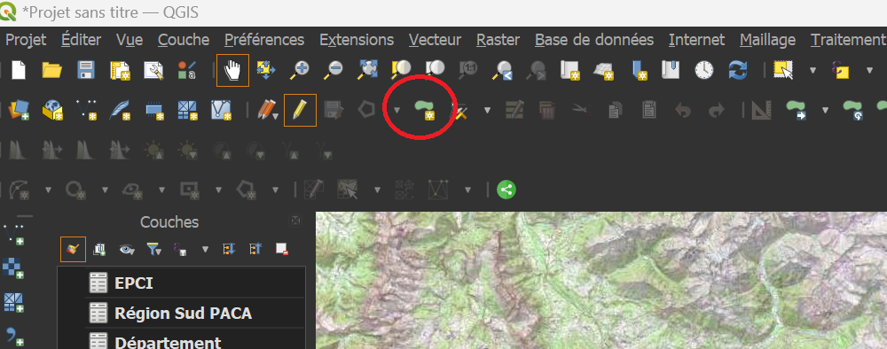
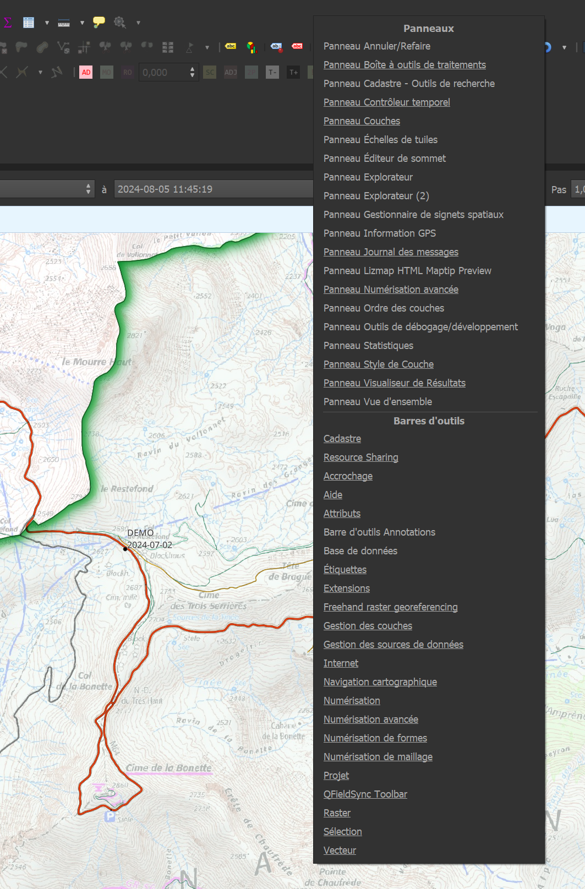

# Le projet QGIS

Ce tutorial explique l'utilisation du projet Qgis destiné à organiser la surveillance pendant le passage du Tour de France au col de la Bonette.

## où trouver le projet

Une fois QGIS ouvert, vous pourrez trouver ce projet de la même façon que pour les autres projets stockés sur la base de données du Parc.

- Dans la barre de menu en haut à gauche Cliquer sur 
- "Projet > Ouvrir depuis > PostgreSQL" 

 

Puis dans le menu déroulant bien choisir la connexion"Service projets", puis le schéma "tourdefrance",
le projet "stationnement_bonnette" devrait s'afficher automatiquement.
 

## Edition

Dans ce projet, seules 3 couches sont à éditer: 

- surveillance
- bivouac_tourdefrance_aremplir
- parking_tourdefrance_aremplir

Les autres couches chargées dans ce projet le sont uniquement pour servir de points de repère. Vous pouvez à tout moment en désactiver l'affichage en cliquant sur l'icone en forme d'oeil à côté du nom de la couche. 

Pour éditer ces couches, il faut d'abord cliquer sur la couche, puis entrer en mode édition:
 

Ensuite, vous pourrez ajouter une entité:

- Proche de l'icone de crayon, dans la barre d'outils, se trouve l'icône "Ajouter une entité"

 

- Après avoir cliqué dessus, votre curseur change. Vous pouvez directement ajouter des points qui formeront un polygone
- Un clic gauche vous permet d'ajouter un point, un clic droit termine la saisie d'une entité sans en rajouter de nouveau, _donc pour faire un rectangle, il faut 4 clics gauches + 1 clic droit_.
- A chaque fin de saisie, une boite de dialogue s'ouvre, permettant d'entrer manuellement les attributs de l'entité. 

Vous pouvez aussi modifier directement la table attributaire, en faisant clic droit sur la couche puis "Ouvrir la table d'attributs".
Là vous pourrez directement modifier les cellules vous concernant. 

NB: 
Si vous ne trouvez pas une entité que vous avez pourtant créée, il est possible que la table d'attribut d'une couche ne montre pas toutes les entités.
En bas à droite de de la fenêtre de la table d'attributs se trouve une petite icône avec un menu déroulant "Ne montrer que les entités visibles sur la carte", 
vous pouvez choisir à la place l'option "Montrer toutes les entités".
Cette option n'est pas activée par défaut pour éviter de planter QGIS au cas où la table d'attributs serait trop grande pour la mémoire de votre machine. 

Pensez à bien entrer votre nom dans "agent", afin qu'il soit possible de vous contacter en cas d'informations contradictoires. 

Il est préférable de rajouter des commentaires à une entité plutôt que de la supprimer en cas de désaccord. 

## Affichage temporel de la couche surveillance

Par défaut, la couche surveillance est paramétrée en affichage temporel. Cela signifie que seules les entités correspondant à la date d'affichages apparaitront.

Pour afficher le controleur temporel et choisir la date d'affichage, faire un clic droit sur la barre d'outils, et sélectionner "Panneau - Controleur Temporel"
 

la plage d'animation par défaut est définie entre le 01-07-2024 et le 05-08-2024, chaque jour étant affiché successivement.

