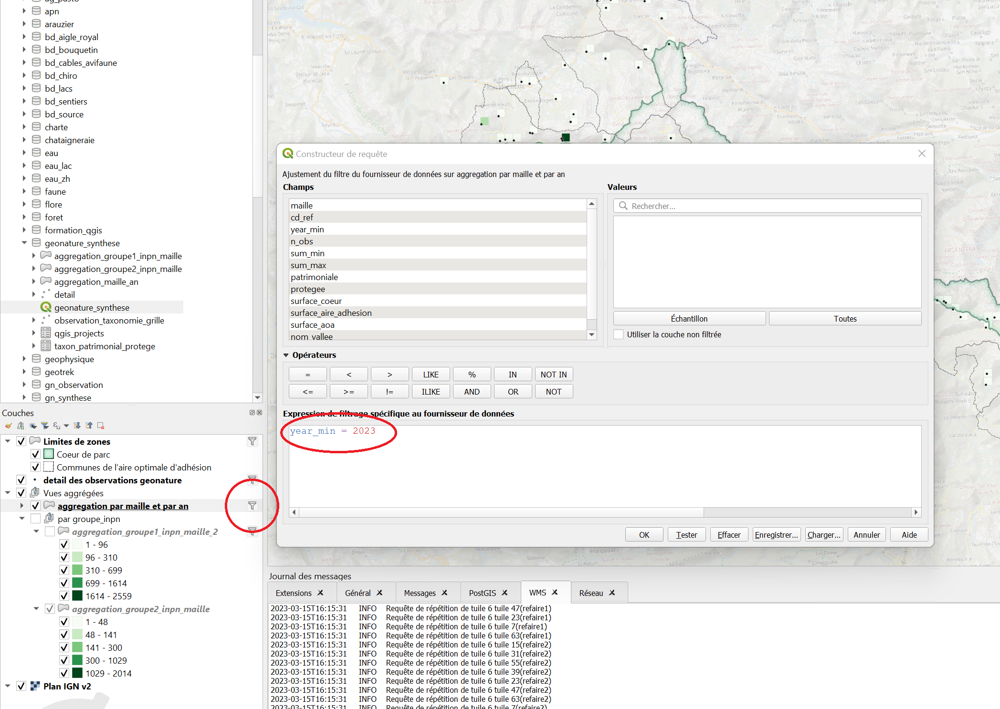
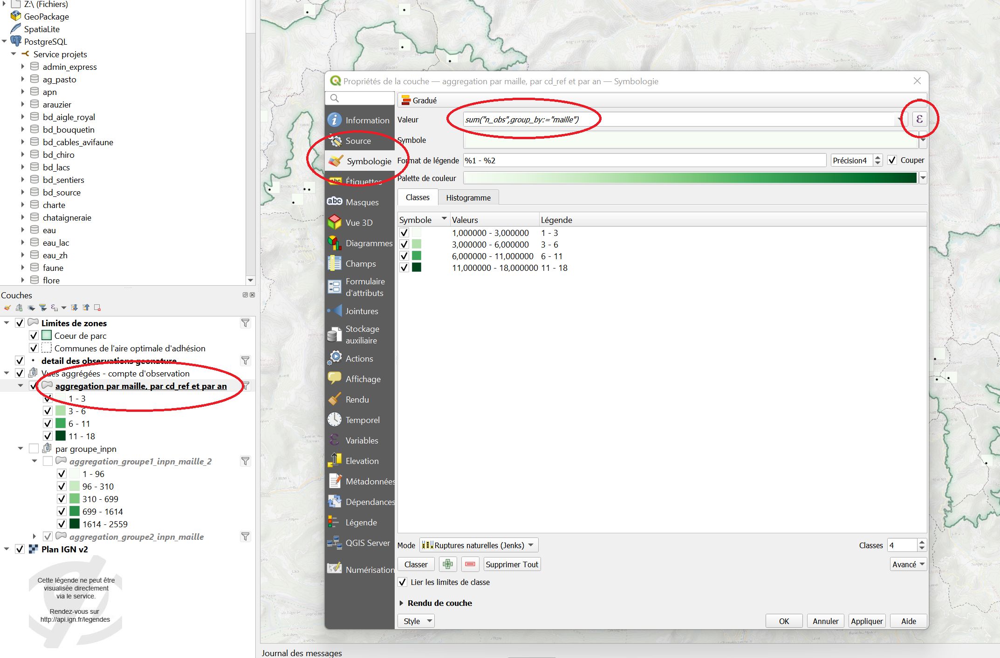
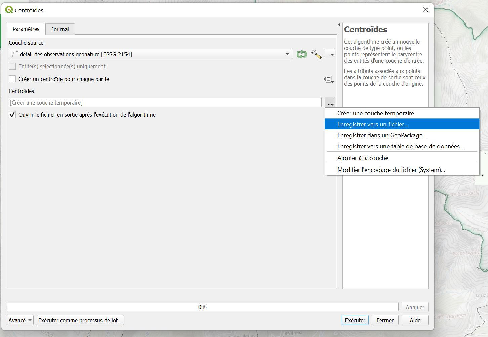

# Résumé

Ce document vise à définir les bonnes pratiques  pour le travail géomatique, et les conventions de nommage pour les fichiers, projets  et couches qgis dans la bd_pnm.
Ces recommandations sont sujettes à exception, mais leur respect général permettra de 
faciliter la relecture, la communication en cas de problème, et le travail.

## Préconisations de nommage
 - Éviter les accents, espaces et caractères spéciaux dans les noms de fichiers (*, #, !, é, ê, ...)
 - Rester cohérent (éviter de changer une nomenclature de nommage i.e.: "Projet1_2023", "2023 projet-2", ...)
 - Privilégier le français (a minima rester cohérent)
 - Éviter les abbréviations qui rendent les noms cryptiques (ex: "liste_patrimoine_protection" plutôt que "lst_pp")

## Dans QGis

### Général
 - Importer les couches et projets depuis le Gestionnaire de sources de données ("Couches>Gestionnaire de source de données" ou CTRL+L)
 et pas depuis l'explorateur. Particulièrement pour les couches provenant de la base de données (Postgresql)
  

 - Au chargement d'un projet, certaines couches peuvent être filtrées. Ce filtre peut être appliqué par l'outil filtre et/ou dans le menu symbologie. 
Ces filtres doivent être modifiés pour accéder aux données pertinentes, ou à l'intégralité des données.
 

_L'application d'un filtre est signalée par l'icône de filtre. En cliquant dessus on accède au constructeur de requête qui 
permet de modifier les paramètres du filtrage._

 

_L'utilisation d'une expression dans la symbologie ("Couche>Propriétés>Symbologie" ou double clic sur la couche - onglet symbologie)
permet de filtrer ou regrouper l'information. Ici on obtient la somme de n_obs par maille. L'expression est modifiable directement ou 
en cliquant sur le ε pour accéder à l'éditeur d'expressions._

	 
 - Éviter tout particulièrement les accents, espaces et caractères spéciaux dans les noms de fichier ou de projet.
 - Ne pas trop encombrer un projet Qgis de trop nombreuses couches, préférer utiliser un projet par objectif.
 - Avoir un dossier par projet, contenant le projet Qgis dédié, et les données locales (s'il y en a).
 - Utiliser des alias pour les couches pour en faciliter la lecture (en utilisant le clic droit sur la couche puis "Renommer". Cette opération
n'est que cosmétique et ne modifie pas les données ni le fichier).
 - Penser à utiliser des groupes pour organiser les couches de travail. Cela peut se faire en faisant Clic droit dans le panneau des couches puis
en cliquant sur "Ajouter un groupe". On peut ensuite glisser des couches dans le groupe pour les rendre visible/invisible en un clic. 

 
### Pour le travail en local
 - Toujours conserver une copie intacte des données de travail par exemple dans un sous-dossier
 - Penser à supprimer les produits intermédiaires de votre projet, et des fichiers.
 - Privilégier les exports en dur aux couches temporaires pour les résultats de géotraitements 
  

_Exemple: "Enregistrer vers un fichier" plutôt que "Créer une couche temporaire"._
 
### En cas de problème
 - Vérifier la projection (CRS: EPSG:2154)
 - Vérifier qu'on travaille bien sur les bons fichiers ('couche'> Propriétés>Source)
 - Vérifier la nature des données sur lesquelles on travaille (vecteur/raster, type de données dans les colonnes...)
 - Si le projet en question n'est pas compliqué, essayer d'exécuter la tâche voulue dans un projet vierge.
 - Redémarrer Qgis.

