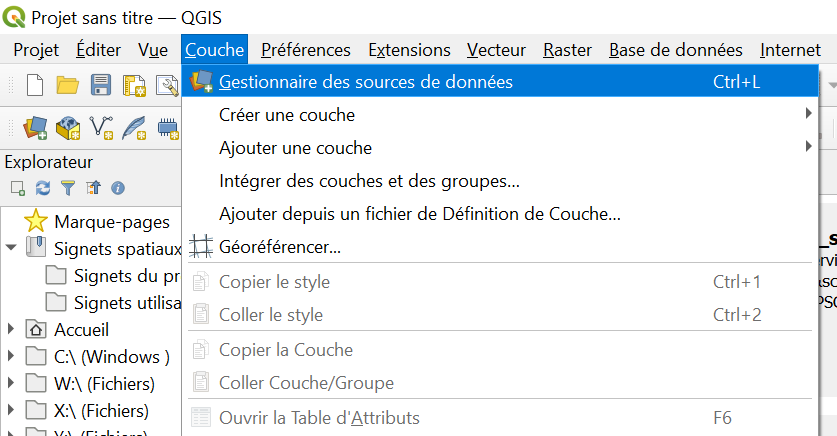

# Accès au catalogue de données WMS/WFS.

<!--Ce tutorial détaille les étapes permettant de configurer l'accès au catalogue de données WMS/WFS du Parc national du Mercantour.
Il exige d'avoir reçu au préalable un fichier zip du service informatique du Parc. --> 

## Avant de commencer

 - _Vous êtes bien sur une session windows qui n'est pas partagée._

## Etapes du paramétrage

- Télécharger le fichier [service WMS.xml en cliquant sur ce lien](https://github.com/PnMercantour/donnees/blob/main/tutos/ressources/service%20WMS.xml), puis sur l'icône permettant le téléchargement.
_(Il sera nécessaire de revenir manuellement sur cette page pour la suite du tuto)_
 

- Déplacer ce fichier dans un dossier où il sera facile à retrouver.
 
> Exemple: C:\Users\"VotreNom"\Documents\QgisXML
_Remplacer "VotreNom" par le nom d'utilisateur sur votre machine._
- Lancer Qgis
 
- Ouvrir le gestionnaire de sources de données (Onglet "Couche>Gestionnaire de source de données" ou CTRL+L). 
 

- clic droit sur WMS/WMTS dans l'explorateur, sélectionner "charger des connexions" 

 - Sélectionner le fichier "service WMS.xml" précédemment enregistré. 
Une fenêtre s'ouvre, clic sur 'Tout Sélectionner' puis 'Importer'

_Cette opération a enrichi l'annuaire des couches WMS avec les catalogues IGN les plus souvent utilisés._
_Vous pouvez maintenant ajouter des fonds de carte au format wms en suivant la démarche décrite [ici](./ajout_fond_de_carte.md)

