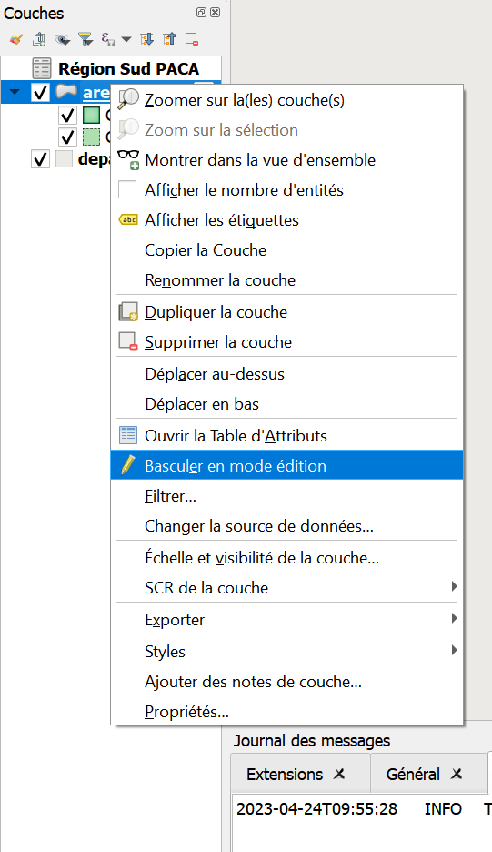

# Edition de polygones.

<!--Ce tutorial détaille les étapes permettant de configurer l'accès au catalogue de données WMS/WFS du Parc national du Mercantour.
Il exige d'avoir reçu au préalable un fichier zip du service informatique du Parc. --> 

## Avant de commencer

 - _Vous désirez modifier la forme ou les attributs d'un fichier au format vecteur (.gpkg/.shp)_

 -_Vous avez les autorisations pour modifier ce fichier dans la base de données/ Ou bien Ce fichier se trouve bien en local ([Comment vérifier?]())_
 
 
## Edition de Polygones

- Activer le mode édition (2 façons possibles).
	- En sélectionnant la couche à modifier, puis en cliquant sur l'icône de crayon dans la barre d'outils en haut de l'écran  
 
	- Ou bien, en faisant un clic droit sur la couche à modifier, puis en cliquant sur  l'icône crayon "Basculer en mode édition"
 

- Une fois dans ce mode, un crayon apparait au dessus du symbole de la couche
 

- .. et de de nombreux outils deviennent accessibles dans la barre d'outil. Ces outils sont regroupés dans les barres d'outils "Numérisation" et "Numérisation avancée", 
visibles en faisant un clic droit sur une des barres d'outils en haut de l'écran, ou bien dans la barre de menu "Vue > Barres d'outils > ..."

 

_A partir de là, un grand nombre d'opérations sont disponibles, nous ne décrirons que les plus simples._

### Créer une nouvelle entité

- Proche de l'icone de crayon, dans la barre d'outils, se trouve l'icône "Ajouter une entité"

 

- Après avoir cliqué dessus, votre curseur change, et vous pouvez directement ajouter des points qui formeront, suivant le type de géométrie que votre couche contient
	- une entité 
	- une partie de ligne ou de polygone
- Un clic gauche vous permet d'ajouter un point, un clic droit termine la saisie d'une entité sans en rajouter de nouveau (_donc pour faire un rectangle, il faut 4 clics gauches + 1 clic droit_)
- A chaque fin de saisie, une boite de dialogue s'ouvre, permettant d'entrer manuellement les attributs de l'entité. Dans la plupart des cas, vous n'êtes pas obligé d'entrer
quoi que ce soit, et pouvez simplement cliquer sur OK pour continuer la saisie. Pour certaines couches il sera nécessaire d'entrer manuellement un id avant de pouvoir continuer à saisir des entités.

 

### Modifier la géométrie d'une entité existante

- L'outil sommet, disponible dans la barre d'outil numérisation à droite de l'outil d'ajout d'entité permet d'ajouter, supprimer, ou créer de nouveaux sommets.
 
- Une fois l'outil sommet sélectionné, on peut sélectionner n'importe quel sommet en cliquant dessus. Les sommets de chaque polygone sont visibles sous la forme de petits cercles rouges

 

- Après avoir sélectionné un sommet avec l'outil sommet, il est possible de le supprimer en appuyant sur la touche "Suppr" du clavier. 
- On peut aussi le déplacer, en cliquant à nouveau avec le clic gauche à un autre endroit après avoir sélectionné un sommet. 

- Enfin, il est possible de créer de nouveaux sommets dans un polygone en cliquant très précisément sur la croix qui apparait en faisant passer le curseur entre deux sommets. 
 

En combinant le déplacement, la modification, et la création de sommets, il est possible de changer complètement la forme d'un polygone.

_Tant que les modifications n'ont pas été enregistrées, elles ne sont pas définitives; _

### Modifier les attributs d'une entité

- Une fois activé l'outil édition, il est possible de simplement éditer à la main les cases de la table attributaire. On peut activer le mode édition depuis la barre d'outils de la table attributaire.
 

