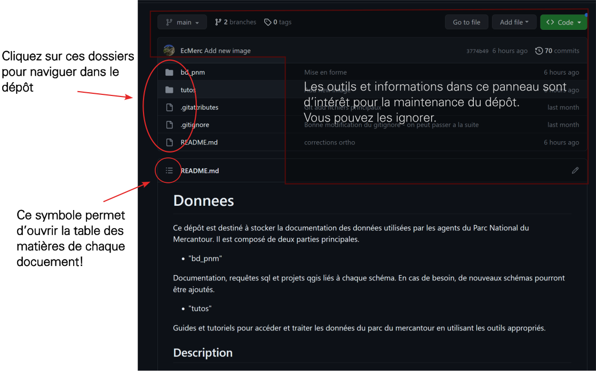
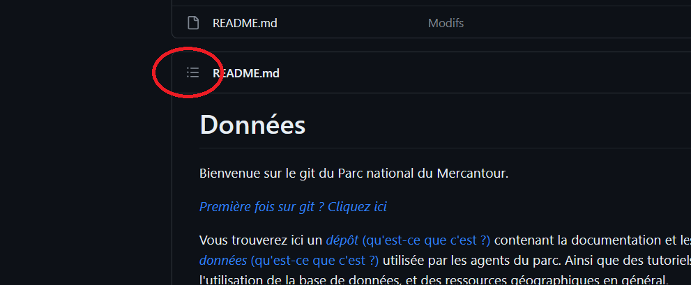
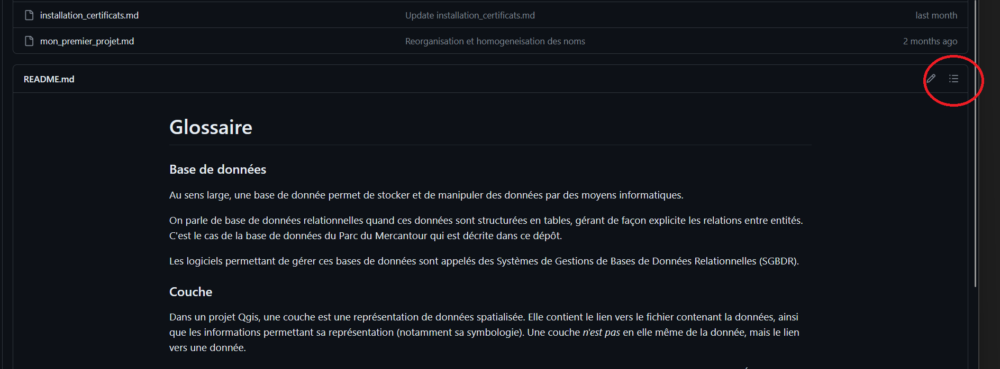

## Première fois sur git ? 

Voici une explication rapide de la fenêtre: sur laquelle vous vous trouvez:

 

Git est un logiciel qui permet de gérer facilement du code et de la documentation. 

Github permet à ses utilisateurs de créer des espaces ou déposer du code et de la documentation - des dépôts. 
Le dépôt "données" du Parc National du Mercantour contient à la fois des descriptions de sa base de données, et des tutoriels à l'usage des agents. 

Vous pouvez naviguer dans le dépôt à la fois par les dossiers plus hauts, et par les liens intertextes cliquables 
comme [celui-ci](./git.md) (qui ne fait que vous renvoyer ici).

Dans chaque page comportant des titres et des sous-titres, une table des matières est générée automatiquement. Elle est visible en cliquant sur son icône 
qui peut se trouver en haut à gauche....
 

...ou en haut à gauche de la page. 
 

Pour revenir à la page d'accueil qui détaille l'ensemble du contenu du dépôt [cliquez ici](/../)