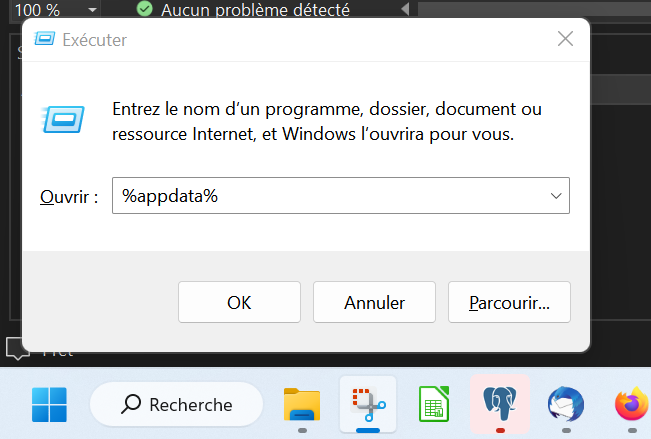

# Installation des certificats
## Avant de commencer

 - _Vous avez reçu un fichier zip de la part du service informatique contenant les certificats permettant l'accès ça la base de données_

- Naviguer jusqu'au dossier AppData


Il se trouve typiquement dans un chemin ressemblant à:
```
C:\Users\ *[nomdelasession]* \AppData\Roaming
```
Le façon la plus simple de l'atteindre consiste à appuyer sur  _touche windows + R_, 
puis à entrer la commande "%AppData%" dans l'invité de commande (la touche windows se trouve entre Ctrl et Alt). [Illustration](#acces-au-dossier-appdata)

(Ce répertoire est masqué par défaut, il est aussi possible de naviguer jusqu'à lui, en autorisant
l'affichage des fichiers cachés dans les options)

- Créer un dossier "postgresql" dans le dossier AppData\Roaming s'il n'existe pas
- Copier dans ce dossier tous les fichiers du zip, y compris le fichier masqué .pg_service.conf


(les remplacer s'ils existent déjà)

## Illustrations

### Accès au dossier AppData



_Après avoir appuyé sur la touche WINDOWS+R , la fenêtre "Exécuter" apparait_
