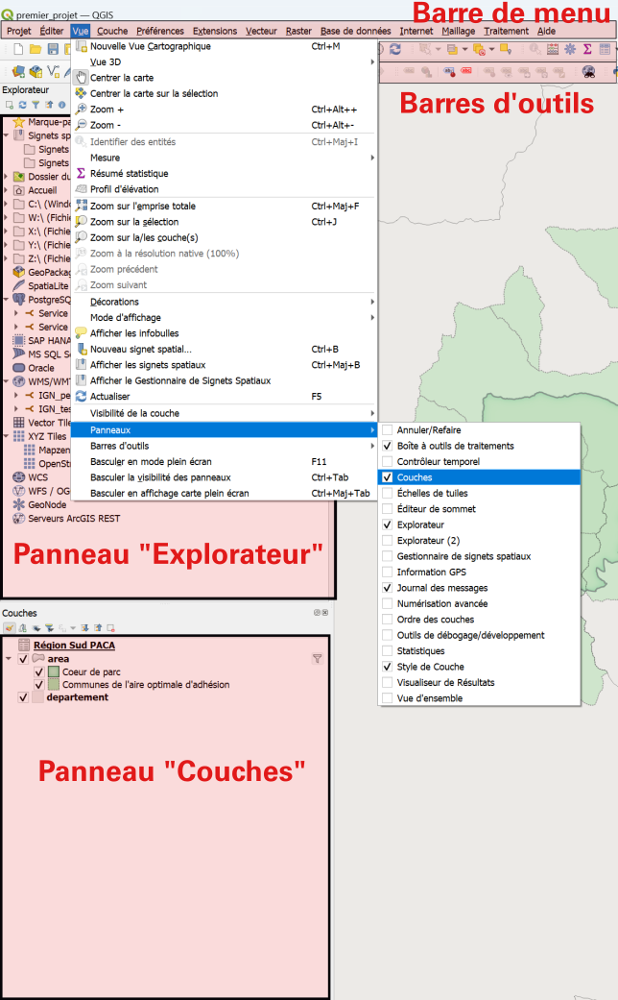

# Mon Premier projet

_Vous avez reçu des la confirmation du SI que vous êtes autorisé à utiliser la [base de données](./README.md#base-de-donnees 
"Au sens large, une base de donnée permet de stocker et de manipuler des données par des moyens informatiques.")
du parc ? Voilà comment faire !_


_Ce tutoriel contient les étapes pour la consultation d'un [projet Qgis](./README.md#projet "Un projet Qgis contient un ensemble de couches,
les informations permettant de les représenter, ainsi que l'ensemble des paramètres conditionnant la réalisation de géotraitements.") existant, 
ainsi que les possibles opérations à réaliser pour en faciliter la visualisation._

> Scénario: On vous a demandé d'établir pour certaines zones la présence ou l'absence d'une espèce végétale donnée. 

> Pour cela, vous devez consulter un [projet Qgis](./README.md#projet "projet Qgis contient un ensemble de couches,
les informations permettant de les représenter, ainsi que l'ensemble des paramètres conditionnant la réalisation de géotraitements."), 
entrer vos relevés terrains en modifiant une couche existante.


## Accès à la [base de données](./README.md#base-de-donnees)
_Cette partie reprend le processus décrit dans [ce tutoriel](./installation_certificats_base_de_donnees.md)._
### 1. Vérifier que vous avez bien accès à la base de données par Qgis. 


Pour cela vous pouvez ouvrir Qgis et charger le projet depuis la base de données. 

 

Si les [couches](./README.md#couche "Dans un projet Qgis, une couche est une représentation de données spatialisée") s'affichent bien, vous pouvez passez au paragraphe 2 "Charger les connexions wms". 
Sinon, continuer au paragraphe suivant.

#### Installation des certificats pour l'accès à la base de données _(si nécessaire)_
_Pour vérifier si vous avez déjà paramétré la connexion à la base de données, ouvrir Qgis puis lancer le gestionnaire_
 _de sources de données (Onglet "Couche>Gestionnaire de source de données" ou Ctrl+L). Cliquer sur l'onglet PostgreSQL._
 _Si le menu déroulant est vide ou ne contient pas "Service projets", continuer cette partie du tutoriel, sinon passer à la partie suivante_


- Télécharger le fichier zip qui vous a été envoyé par le SI

- Naviguer jusqu'au dossier AppData.

Il se trouve typiquement dans un chemin ressemblant à:
```
C:\Users\ *[nomdelasession]* \AppData\Roaming
```
Le façon la plus simple de l'atteindre consiste à appuyer sur  _touche windows + R_, 
puis à entrer la commande "%AppData%" dans l'invité de commande (la touche windows se trouve entre Ctrl et Alt). 

(Ce répertoire est masqué par défaut, il est aussi possible de naviguer jusqu'à lui, en autorisant
l'affichage des fichiers cachés dans les options)

- Créer un dossier "postgresql" dans le dossier ..\AppData\Roaming s'il n'existe pas

- Copier dans ce dossier tous les fichiers du zip, y compris - et surtout - le fichier masqué .pg_service.conf
(les remplacer s'ils existent déjà)

#### Chargement des paramètres pour accéder à la base de données

- Télécharger le fichier suivant, en faisant "clic droit>Télécharger la cible du lien sous " sur le lien suivant: [service postgresql.xml en cliquant sur ce lien](https://github.com/PnMercantour/donnees/blob/main/tutos/ressources/services%20postgresql.xml).

- Ouvrir Qgis

- Ouvrir le gestionnaire de sources de données (Onglet "Couche>Gestionnaire de source de données" ou Ctrl+L) 

- Cliquer sur PostgreSQL dans la barre de gauche

 

- Cliquer sur "charger" et retrouver le fichier "service projets.xml" que vous venez de copier


- Vérifier que la connexion "Service projets" est disponible, et se connecter

_La liste des [tables et schémas](./README.md#schéma "Dans une base de données relationnelle, un schéma regroupe différents objets dont des tables, vues et fonctions.") 
accessibles devraient apparaître._


_NB: Le gestionnaire de données est le moyen à privilégier pour importer des données au projet courant. 
(Les autres façons d'ajouter des couches peuvent créer des problèmes en appliquant des paramètres d'import par défaut)_

_Cette étape visait à vérifier et mettre en place la connexion à la base de données. Maintenant nous allons mettre en place les connexions aux wms qui permettent_
_de charger des fonds de carte._

### 2. Charger les connexions wms

#### Service WMS (fonds de carte) _(si nécessaire)_

_Pour vérifier si vous avez déjà chargé le catalogue de ressources WMS, ouvrir Qgis puis lancer le gestionnaire_
 _de sources de données (Onglet "Couche>Gestionnaire de source de données" ou Ctrl+L). Cliquer sur l'onglet WMS/WMTS._
 _Si le menu déroulant est vide, continuer cette partie du tutoriel, sinon passer à la partie suivante_

- Télécharger le fichier [service WMS.xml en cliquant sur ce lien](https://github.com/PnMercantour/donnees/blob/main/tutos/ressources/service%20WMS.xml), puis sur l'icône permettant le téléchargement.
_(Il sera nécessaire de revenir manuellement sur cette page pour la suite du tuto)_
 

Déplacer ce fichier dans un dossier où il sera facile à retrouver.
 
> Exemple: C:\Users\"VotreNom"\Documents\QgisXML
_Remplacer "VotreNom" par le nom d'utilisateur sur votre machine._

Une fois Qgis lancé, vous pouvez ouvrir le gestionnaire de sources de données (Onglet "Couche>Gestionnaire de source de données" ou Ctrl+L).

 


- clic droit sur WMS/WMTS dans l'explorateur, sélectionner "charger des connexions" 

 - Sélectionner le fichier "service WMS.xml" précédemment enregistré. 
Une fenêtre s'ouvre, clic sur 'Tout Sélectionner' puis 'Importer'


### 3. Charger le projet d'intérêt

Récupérer le projet en cliquant sur "Projet > Ouvrir Depuis > Postgresql" dans la barre de menu

 

<!--
#### Remplacer des couches manquantes

_Un projet Qgis ne contient pas les données, juste les liens y menant. Il est donc normal qu'en ouvrant un projet sans disposer
de toutes les données liées, des erreurs s'affichent._

Dans ce cas, si les données sont accessibles, il est facile de remplacer le chemin d'accès pour réparer le projet.

Pour ce faire, vous pouvez télécharger les données manquantes ici en faisant clic droit - Enregistrer la cible du lien sous:

- [Presence à completer](./ressources/couche_test_a_remplir.gpkg)
- [Observations](./ressources/pts_random_tinee.gpkg)

vous pourrez ensuite
--> 


## Visualisation des données du projet
_Vous avez bien réussi à charger le projet "MonPremierProjet" et en voyez le contenu. Nous allons maintenant passer en revue 
les moyens de naviguer dans le projet et observer les données._


1. Afficher/masquer des couches

_Dans Qgis, la position de la plupart des éléments sont personnalisables, et il arrive qu'on les modifie par accident. 
Si ça arrive, cas on pourra les retrouver dans l'onglet "Vue", et vérifier que le panneau ou la barre d'outils concernée est bien visible._


 

A gauche de chaque couche se trouve une petite boite qui peut être cochée ou décochée. 
Cette boite permet d'afficher ou de masquer chaque couche, ou élément de symbologie d'une couche.


2. Les propriétés

Double cliquer sur une couche, ou faire "clic droit > Propriétés" en affiche les propriétés. 

_**Le détail de la table attributaire n'est pas visible dans les propriétés.**_

Là vous avez accès à une série d'onglet donnant des informations sur la couche en question. 
L'onglet "Information" est particulièrement important pour:
- vérifier la source des données (si vous travaillez sur des données stockées sur votre machine, le chemin détaillé vers le fichier apparaitra, 
si vous travaillez sur le serveur ce seront les paramètres de connexion qui seront visibles).
- vérifier le type de données ( raster/vecteur, type de géométrie) et la projection
- vérifier le décompte d'entité (il s'agit du décompte après application du filtre)


3. Les filtres

Vous pouvez remarquer un symbole :  
 à droite de certaines couches:


 


Il signifie que la couche en question est filtrée. Les filtres sont des outils très puissants, notamment pour limiter la charge sur vos ordinateurs. 
Ils sont appliqués au niveau du serveur, et permettent de ne charger que les entités d'une couche que vous aurez choisies par une expression. 

Par exemple, en cliquant sur le symbole filtre de "Vallees" ou en faisant clic droit > Filtre sur cette couche vous voyez l'expression suivante :
```sql
"id_type" = 3
```

qui signifie: 
```
"Ne charge que les entités pour lesquelles la colonne "id_type" a la valeur 3."
```


_Certaines couches du serveur sont chargées par défaut avec des filtres. Il est tout à fait possible de les modifier pour accéder à d'autres données, 
ou de restreindre encore le filtre proposé le temps de la consultation du projet. Dans ce cas, veillez cependant à ne pas enregistrer vos modifications sur un projet partagé._

_Néanmoins, vous êtes encouragés à apprendre à les utiliser. Les filtres emploient une syntaxe SQL et un [tutoriel](./lienavenir "Lien à venir") dédié sera créé._


4. La table attributaire

Les couches au format [vecteur](./README.md#vecteur "En géomatique, un vecteur est l'un des deux modes principaux de représentation des données spatiales. 
") contiennent une [table attributaire](./README#table-attributaire "La table attributaire contient l'ensemble des données, spatiales ou non, liées à une couche vecteur.
"), donnant des informations sur les données qu'elles contiennent. 
Vous pouvez visualiser cette table en cliquant droit sur la couche puis sur "Ouvrir la table d'attributs".

 


Il existe deux façons de représenter la table attributaire. Une vue "Table" et une vue "Formulaire". On peut basculer de l'une à 
l'autre en cliquant sur l'icone correspondante en bas à droite de la fenêtre. 


   

_A gauche, la table atributaire en format table. A droite,en format formulaire. Le mode table permet de visualiser d'un coup d'oeil l'ensemble des entités et attributs simultanément.
Le mode formulaire permet de visualiser et les entités une à une, la liste des entités apparaissant sur la gauche._


Si votre version de Qgis a bien été paramétrée, en bas à gauche de la table attributaire devrait apparaitre un bouton-déroulant: "Ne montrer que les entités visibles sur la carte".
Cette option peut être modifiée de façon à toujours montrer toutes les entités, cependant ce mode d'affichage peut faire planter Qgis sur les couches contenant un grand nombre d'entités. 

Le mode d'affichage par défaut est modifiable dans les paramètres de Qgis: 

Préférences>Options>Sources de données - "Comportement des tables d'attributs"


## Editer une couche

_On se concentrera sur les couches au format [vecteur](./README.md#vecteur ). Toutes les couches présentes dans le projet tuto sont dans ce format. 
Il existe des méthodes pour modifier les [rasters](./README.md#raster ), mais nous ne les aborderons pas ici._

_L'édition d'une couche contenue dans la base de données est possible seulement si des droits particuliers vous ont été accordés. La plupart des couches sont uniquement consultables._

### Enregistrer une couche localement


Editer une couche Qgis modifie le fichier de source des données. Il est donc important de rester prudent et de conserver une copie des données d'origine quand c'est possible. 
Pour cela faire clic droit sur la couche
> Exporter > Sauvegarder les entités sous
Puis en cliquant sur les "..." naviguer sur l'emplacement de votre machine ou vous souhaitez enregistrer la couche.

Une fois la nouvelle couche enregistrée, elle devrait apparaitre dans le projet. Vous pourrez vérifier qu'il s'agit bien d'une copie locale 
en vérifiant son emplacement dans ses propriétés (clic droit> Propriétés onglet Information)

### Mode Edition

Pour réaliser des modifications ou créer une nouvelle entité, il faut d'abord activer le mode Edition pour la couche d'intérêt. Cela peut se faire de plusieurs façons: 

| 
Dans la barre d'outils Qgis 

   

En passant par un clic droit sur la couche

 

depuis la fenêtre de la table attributaire

Dans tous les cas, cliquer sur le petit crayon activera le mode édition pour la couche sélectionnée. On pourra alors y apporter des modifications de différentes façons.
Ces modifications ne seront toutefois enregistrées et effectives qu'à la sortie du mode édition (en cliquant à nouveau sur le crayon). Si le logiciel crash, ou qu'on ne confirme 
pas les changements à la sortie du mode édition, les changements seront perdus et les données d'origine seront conservées. 

1. Modification de la table attributaire

Une fois en mode Edition, on peut modifier directement la table attributaire à la façon d'un tableur. 


2. Création d'entités/Modification de géométrie

En mode édition, on peut aussi éditer directement la géométrie d'une entité, ou en créer de nouvelles. 

 
L'outil sommet permet de modifier la géométrie de points/lignes/polygones existants


 
Ajouter une entité permet de créer de nouvelles entités


La création d'une nouvelle entité se fait par une succession de clics gauches, et est finalisée par un clic droit.
A la finalisation de chaque entité, une fenêtre s'ouvre proposant d'entrer les attributs connus. 

 

Un "id" ou "fid" correspondant à l'identifiant unique de chaque entité peut être généré automatiquement. 
Il n'est pas nécessaire d'entrer les autres attributs pour que la nouvelle enttité soit sauvegardée. 


Il est souvent pratique d'afficher des barres d'outils supplémentaires (et parfois d'en cacher pour clarifier le menu).
Pour cela, il faut faire clic droit à n'importe quel endroit de la barre d'outils,
ou aller dans Vue > Barres d'outils

Deux outils peuvent être particulièrement pratique pour la numérisation: 

- "Accrochage" qui permet de rendre "magnétique" le clic, et de superposer parfaitement des points et
- "Numérisation avancée" qui permet à des outils de modifications de géométries en mode édition.

(les autres barres d'outils peuvent contenir des outils pratiques. N'hésitez pas à les explorer!)


<!--
### Autoriser le chargement des projets

  -->

## Changer le mode de représentation d'une couche

Dans couche on appelle le mode de représentation des données d'une couche la "symbologie" (exemple: des aplats de couleurs, cercles noirs pour des points, lignes vertes etc...)
Elle peut être modifiée de façon précise pour chaque couche en passant par les propriétés d'une couche, à l'onglet symbologie.

Les outils de symbologie dans Qgis sont très puissants, et permettent de représenter les informations d'une couche de façon synthétique.
On décrit ici les modes de représentation les plus communément utilisés:
- Symbole unique

Mode de représentation le plus simple. On définit un symbole qui sera appliqué de manière uniforme à toutes les entités, sans prendre en compte leurs attributs

- Catégorisé

Permet de représenter des différences qualitatives entre les entités. C'est-à-dire qu'un de leurs attributs permet de les différencier.
> Par exemple: pour des polygones représentant l'occupation des sols, le nom de ces catégories (forêt, culture, bâti etc...).

- Gradué

Permet de représenter des différences quantitatives entre des entités.
> Par exemple: pour des points représentant des villes, on peut faire varier leur taille pour représenter leur population. 


_Dans ce tutoriel nous n'irons pas plus loin sur la symbologie, mais un autre tutoriel lui sera dédiée. Nous vous invitons à faire des essais, tout en prenant soin 
de ne pas écraser la symbologie d'un projet partagé._

## Les outils Qgis

_Qgis peut être utilisé comme un outil d'analyse particulièrement puissants._

En plus des fonctionnalités déjà évoquées, Qgis contient un grand nombre d'outils qui permettent des analyses plus ou moins complexes. 
La plupart des outils sont disponibles dans les menus "Vecteur" et "Raster" de la barre de menu (mais pas tous!). Dans ces onglets, seule une 
sélection des outils est affichée, organisés par catégorie. 

Pour voir l'intégralité des outils disponibles, il faut activer le panneau "Boite à outils de traitement", 

soit dans le menu "Vue > Panneaux"

soit en faisant clic droit sur la barre de menus.


Nous ne rentrerons pas ici dans le détail de ces outils, mais ce sont eux qui permettent de réaliser les opérations les plus complexes de Qgis. 


## Exporter une carte au format image

_Attention, de nombreux projets du Parc contiennent des données qui peuvent être sensibles. Avant de publier ou mettre en circulation des exports de données, veiller à s'assurer 
de leur sensibilité auprès du chargé de mission en lien avec elles._

1. Export simple

Il est possible de réaliser des exports directement depuis le menu de Qgis. A l'onglet Projet > Importer/exporter > Exporter au format Image
Cette façon de faire ne permet que d'exporter le contenu du canevas

 

Cet outil fait apparaitre un menu permettant de choisir l'emprise de l'export: 

 

On peut ainsi facilement exporter au format image la vue de la carte visible à l'écran. 


2. Mises en page

Qgis permet de réaliser des mises en pages de cartes plus complexes. Pour les réaliser, il faut passer par l'outil de mise en page de Qgis.

 

Si une mise en page a déjà été créée pour le projet en question, vous la trouverez ou bien dans le menu "Projet > Mise en page" ou bien
dans le Gestionnaire de mises en page.

Il est aussi possible de créer une nouvelle mise en page. 

Dans tous les cas, à l'ouverture d'une mise en page, une nouvelle fenêtre s'ouvre. 

## Les outils de Qgis


## Sauvegarder un projet localement et le partager

1. Enregistrer le projet en local au format qgs/qgz

_Un projet sous ces formats sera plus léger, mais ne contient pas les données. Seulement le chemin où trouver les fichiers servant à produire les couches._

Vous pouvez à tout moment "enregistrer sous" un projet qui est enregistré sur le serveur. 
Cela en crée une copie qui ne sera plus accessible à personne d'autre que vous, 
mais vous pourrez ensuite le modifier sans risque de perdre le travail de vos collègues.

Un projet enregistré sous ce format ne contient que les chemins menants aux couches ainsi que la définition
de style des couches. Si il dépendait d'une base de données sécurisée et qu'il est déplacé sur un ordinateur 
ne disposant pas de cet accès, la couche sera inaccessible et ne s'affichera pas. 

De même, si le projet d'origine faisait référence à des fichiers locaux, alors le projet copié sur une autre 
machine devra pouvoir retrouver les mêmes fichiers en suivant exactement les mêmes chemins. 

2. Enregistrer le projet au format gpkg

_Sous ce format le projet peut contenir l'ensemble des données, et des informations sur le style permettant de produire les couches. Il est part conséquent bien plus lourd, mais peut être facilement échangé. La démarche pour le construire est toutefois plus complexe._

0. Le format gpkg

Le format geopackage (gpkg) est un format relativement récent qui a l'avantage de pouvoir contenir plusieurs sources de données spatialisées vecteur et raster, tout en conservant l'intégrité de leurs tables attributaires.
Il peut aussi stocker des projets et fichiers de styles. Il réunit ainsi en un seul fichier ce qui traditionnellement demande l'utilisation de formats peu pratiques (shapefile), et évite les problèmes de préservation des chemins relatifs des projets au format qgs/qgz. 

Le format gpkg fonctionne sur le modèle de la base de données, les outils pour l'ouvrir et le modifier sont donc liés au menus de bases de données dans Qgis. 

1. Sauvegarder un projet au format geopackage

Afin de pouvoir enregistrer le projet et l'ensemble des couches le composant dans un geopackage, il faut d'abord créer un geopackage vierge. 
On pourra le faire à l'onglet Couche:
> Couche > Créer une couche > Nouvelle couche Geopackage ...


 

2. Connexion au gpkg

Qgis n'est pas par défaut "conscient" du geopackage nouvellement créé. Il faut définir la connexion à ce fichier. 
Pour cela on peut passer par le gestionnaire de base de données (Ctrl + 3) 
> Base de données > Gestionnaire de base de données

et cliquer droit sur "Geopackage>Nouvelle connexion..." dans le menu de gauche.
On pourra alors naviguer jusqu'au fichier geopackage nouvellement créé. 

3. Enregistrement du projet

Enfin, on pourra simplement aller à:
> Projet > Enregistrer le projet sous.... > Geopackage

Et lui donner un nom (car on peut même enregistrer plusieurs projets dans un geopackage).

4. Ouvrir un projet dans un geopackage

Pour ouvrir le projet ainsi enregistré, il suffit d'aller à 

> Projet > Ouvrir depuis .. > Geopackage

_Si vous recevez un geopackage, il vous faudra possiblement d'abord vous connecter au geopackage en passant le "Gestionnaire de base de données" avant de pouvoir l'ouvrir._


