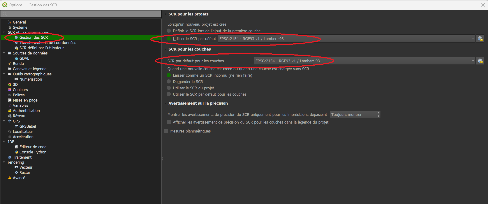
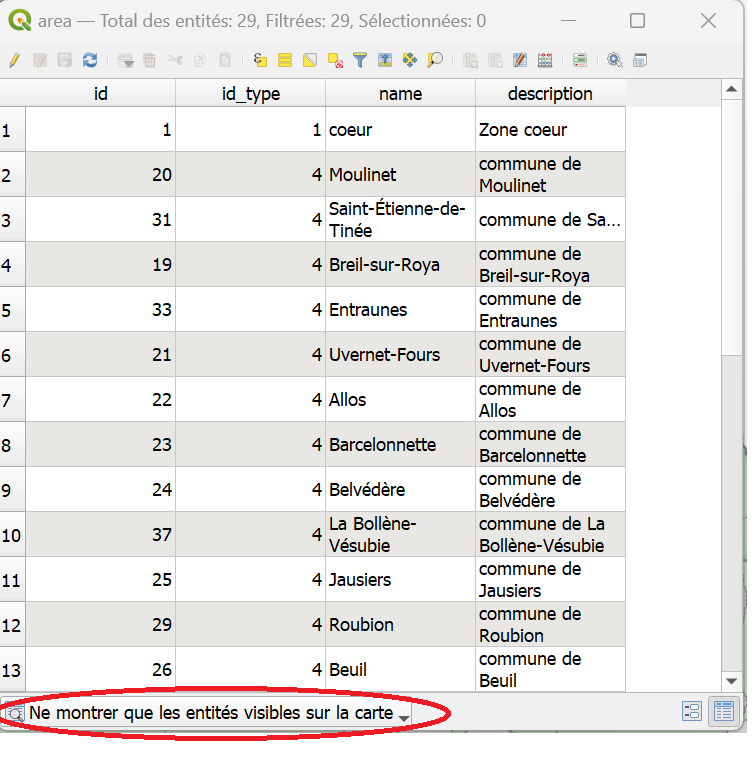

_Ce tutoriel contient toutes les informations pour paramétrer Qgis lors du premier paramétrage._
_Si vous avez déjà accès à la base de données, la plupart des autres indications sont aussi [trouvables ici](./bonnes_pratiques.md)_

# Paramétrages importants
_Ces paramètres sont importants à modifier pour le bon fonctionnement de Qgis, et éviter des plantages et erreurs._

## Projection
Il est capital de gérer la [projection](./README.md#projection) dans Qgis pour que les cartes produites 
soient lisibles dans le système de coordonnées de référence (SCR) français: Lambert-93.

Pour cela, cliquer sur 

> Préférences > Options 

dans la barre de menu en haut de Qgis, et sélectionner le SCR "EPSG:2154 - RGF93v1 /Lambert-93" par défaut à la fois
pour les projets, et pour les couches. 

 

## Table d'attributs


En bas à droite de de la fenêtre de la table d'attributs se trouve une petite icône avec un menu déroulant. 
Choisir l'option "Ne montrer que les entités visibles sur la carte". 

 

Dorénavant, la table d'attribut ne montrera que les entités visibles sur l'étendue du canevas visible, en zoomant et vous déplaçant sur le canevas vous limiterez le nombre d'entités à charger dans la table d'attribut et donc
le risque de plantage de Qgis. 

---
## Se connecter à la base de données
_Si vous pouvez déjà vous connecter à la base de données du Parc, vous pouvez passer à l'étape suivante._

### Installer les certificats
_Vous avez reçu de la part du SI un fichier zip._

- Naviguer jusqu'au dossier AppData.

Il se trouve typiquement dans un chemin ressemblant à:
```
C:\Utilisateurs\ *[nomdelasession]* \AppData\Roaming
```
(Ce répertoire est masqué par défaut, il est aussi possible de naviguer jusqu'à lui, en autorisant
l'affichage des fichiers cachés dans les options)

Le façon la plus simple de l'atteindre consiste à appuyer sur  _touche windows + R_, 
puis à entrer la commande "%AppData%" dans l'invité de commande (la touche windows se trouve entre Ctrl et Alt). [Illustration](#Acces-au-dossier-AppData)

- Créer un dossier "postgresql" dans le dossier ..\AppData\Roaming s'il n'existe pas

- Copier dans ce dossier tous les fichiers du zip, y compris - et surtout - le fichier masqué .pg_service.conf
(les remplacer s'ils existent déjà)

### Charger la connexion à la base de données

- Télécharger le fichier contenant les paramètres de connexion [sur ce lien](./ressources/services postgresql.xml)

- Lancer Qgis

- Ouvrir le gestionnaire de sources de données (Onglet "Couche>Gestionnaire de source de données" ou Ctrl+L) [Illustration](#Gestionnaire-de-sources-de-donnees)

- Cliquer sur PostgreSQL dans la barre de gauche
 

- Vérifier que la connexion "Service projets" est disponible, et se connecter

_La liste des tables et schémas accessibles devraient apparaître._

_Vous pourrez aussi directement charger des projets directement depuis la barre de menu:_
> Projet > Ouvrir depuis... > PostgreSQL

_En choisissant la connexion "Service projets", puis le schéma concerné la liste des projets disponibles s'affichera._


## Ajouter le catalogue de fond de cartes (WMS)

<!--Ce tutorial détaille les étapes permettant de configurer l'accès au catalogue de données WMS/WFS du Parc national du Mercantour.
Il exige d'avoir reçu au préalable un fichier zip du service informatique du Parc. --> 

- Télécharger le fichier (service WMS.xml)[./ressources/service WMS.xml].

- Déplacer ce fichier dans un dossier où il sera facile à retrouver.
 
_Exemple_
> C:\Utilisateurs\ *[nomdelasession]* \Documents\QgisXML

- Lancer Qgis
 
- Ouvrir le gestionnaire de sources de données (Onglet "Couche>Gestionnaire de source de données" ou CTRL+L). 
 

- clic droit sur WMS/WMTS dans l'explorateur, sélectionner "charger des connexions" 

 - Sélectionner le fichier "service WMS.xml" précédemment enregistré. 

- Une fenêtre s'ouvre, cliquer sur 'Tout Sélectionner' puis 'Importer'

_Cette opération a enrichi l'annuaire des couches WMS avec les catalogues IGN les plus souvent utilisés._
_Vous pourrez maintenant ajouter des fonds de carte au format wms en suivant la démarche décrite [ici](./ajout_fond_de_carte.md)

